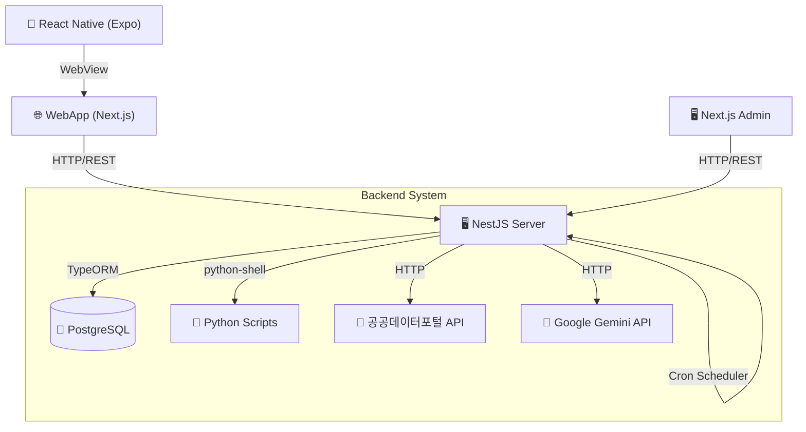
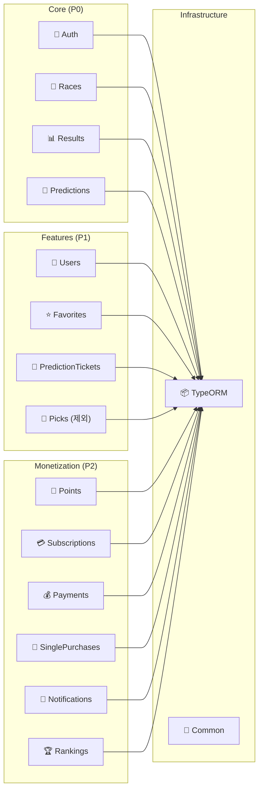
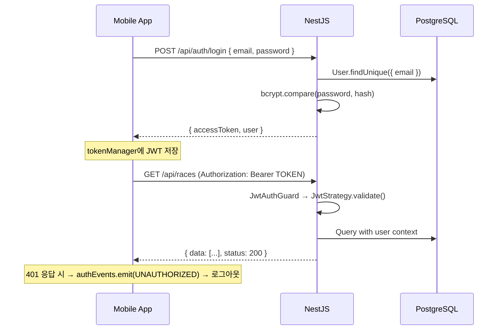

# 🏗️ 시스템 아키텍처 (System Architecture)

> **이 문서는 모든 AI 에이전트/개발자가 작업 전에 반드시 읽어야 하는 핵심 아키텍처 문서입니다.**

**Last updated:** 2026-03-02

---

## 1. 전체 시스템 흐름



### 아키텍처 정리

| 클라이언트 | 연동 방식        | 설명                                                   |
| ---------- | ---------------- | ------------------------------------------------------ |
| **Mobile** | WebView → WebApp | 앱 내 WebView에서 base URL 로드 (반응형)               |
| **WebApp** | HTTP/REST        | 단일 페이지, 화면 크기에 따라 Desktop/Mobile 자동 전환 |
| **Admin**  | HTTP/REST        | 관리자 패널 → `/api/*` 직접 호출                       |

> WebApp–Mobile 연동 상세: [WEBAPP_MOBILE_INTEGRATION.md](./WEBAPP_MOBILE_INTEGRATION.md)

### 요청-응답 흐름 (일반 API)

```
Mobile WebView → WebApp 페이지 → axios (Bearer JWT) → NestJS Controller → Service → TypeORM → PostgreSQL
Admin / WebApp → axios (Bearer JWT) → NestJS Controller → Service → TypeORM → PostgreSQL
                                                         ↓
                                                  ResponseInterceptor
                                                         ↓
                                              { data: T, status: 200 }
```

### AI 예측 흐름 (Prediction Pipeline)

```
Cron Scheduler (경기 시작 전)
    ↓
1. NestJS가 공공데이터포털에서 경기/출전마 데이터 수집
    ↓
2. 데이터를 JSON으로 Python Script에 전달 (python-shell)
    ↓
3. Python이 3가지 점수 계산:
   - Speed Index (보정 주파 기록)
   - Momentum Score (기세 지수)
   - Compatibility (기수-말 적합도)
    ↓
4. NestJS가 말·기수 통합 finalScore 산출 (해당 경주에 결과·winOdds 있으면 점수에 배당 암시확률 20% 반영. [BET_TYPE_ODDS_ALIGNMENT.md](../features/BET_TYPE_ODDS_ALIGNMENT.md))
    ↓
5. 계산 결과 + 원본 데이터를 Gemini API에 프롬프트로 전달
    ↓
6. Gemini가 분석 코멘트 생성
    ↓
7. 결과를 DB predictions 테이블에 캐싱
    ↓
사용자 → GET /api/predictions/race/:raceId → DB에서 캐싱된 결과 반환 (Gemini 호출 없음)

> 점수에 배당 반영 상세: [BET_TYPE_ODDS_ALIGNMENT.md](../features/BET_TYPE_ODDS_ALIGNMENT.md)
```

---

## 2. 모듈 아키텍처



---

## 3. 인증 플로우



### JWT 구조

```typescript
// JwtPayload (server/src/common/decorators/current-user.decorator.ts)
class JwtPayload {
  sub: string; // userId
  email: string;
  role: UserRole; // USER | ADMIN
}
```

---

## 4. 응답 포맷 (Response Format)

### 서버 응답 래핑 (ResponseInterceptor)

모든 API 응답은 `ResponseInterceptor`에 의해 자동 래핑됩니다:

```typescript
// 성공 응답
{
  data: T,        // 실제 데이터
  message?: string,
  status: number  // HTTP status code (200, 201 등)
}

// 에러 응답 (NestJS ExceptionFilter)
{
  statusCode: number,
  message: string,
  errors?: Record<string, string[]>
}
```

### 모바일 측 처리

```typescript
// mobile/lib/utils/axios.ts
const API_BASE_URL = `${config.api.server.baseURL}/api`; // /api prefix 자동 추가

const handleApiResponse = <T>(response): T => {
  return response.data.data; // ResponseInterceptor의 data 필드 추출
};
```

---

## 5. 핵심 설계 원칙

| 원칙                       | 설명                                                                     |
| -------------------------- | ------------------------------------------------------------------------ |
| **Server-Side Caching**    | Gemini 분석은 Cron으로 미리 실행 → DB 캐싱 → 사용자는 DB만 읽음          |
| **Python은 순수 계산**     | DB 접근 없이 NestJS가 주는 JSON만 받아서 점수 계산 후 반환               |
| **NestJS = Control Tower** | 모든 외부 서비스(Python, Gemini, KRA API) 호출은 NestJS가 관리           |
| **Global API Prefix**      | `main.ts`에서 `app.setGlobalPrefix('api')` → 모든 라우트에 `/api` prefix |
| **JWT 인증**               | `@UseGuards(JwtAuthGuard)` + `@CurrentUser()` 데코레이터로 사용자 식별   |
| **TypeORM**                | 모든 DB 조작은 TypeORM Entity/Repository/QueryBuilder 사용 (DataSource 주입) |

---

## 6. 외부 서비스 연동

| 서비스             | 용도                         | 연동 방식                        |
| ------------------ | ---------------------------- | -------------------------------- |
| **공공데이터포털** | 경마 경기/결과 실시간 데이터 | REST API (axios)                 |
| **KRA API72_2**    | 경주계획표 (미래 일정)       | `racePlan_2` — Cron·Admin 수동   |
| **KRA API26_2**    | 출전표 (출전마)              | `entrySheet_2` — 경주 2~3일 전   |
| **Google Gemini**  | AI 분석 코멘트 생성          | REST API (@google/generative-ai) |
| **Python Scripts** | 통계 분석 (Speed Index 등)   | python-shell (stdin/stdout JSON) |
| **PostgreSQL**     | 데이터 저장소                | TypeORM                          |

---

## 7. 주요 기능 요약

| 기능          | 설명                                                                                                             |
| ------------- | ---------------------------------------------------------------------------------------------------------------- |
| **즐겨찾기**  | RACE(경기)만 지원. `POST /favorites/toggle`                                                                      |
| **알림 설정** | UserNotificationPreference. 푸시는 mobile 전용. [NOTIFICATION_SETTINGS.md](../features/NOTIFICATION_SETTINGS.md) |
