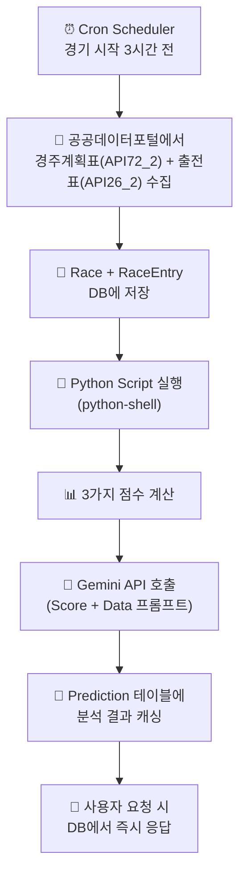
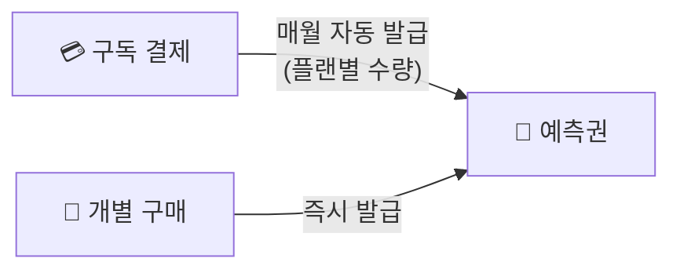
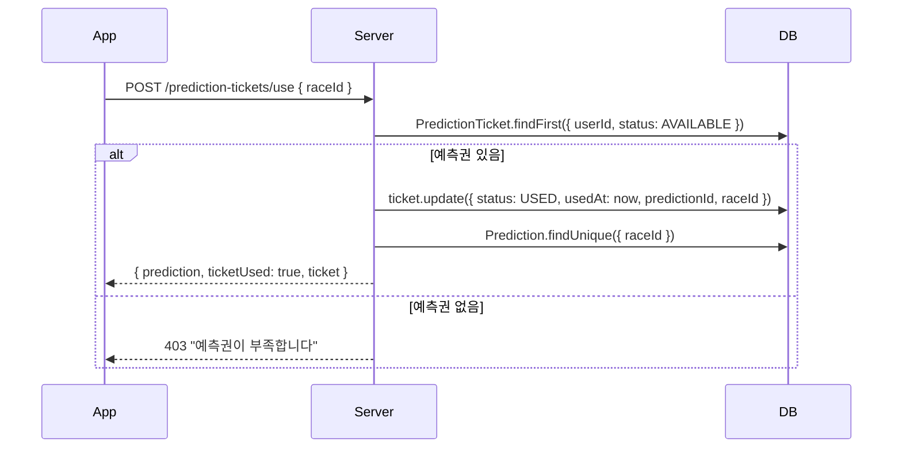
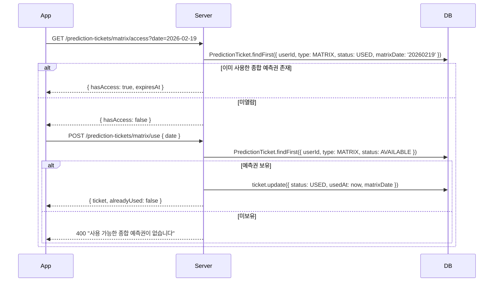
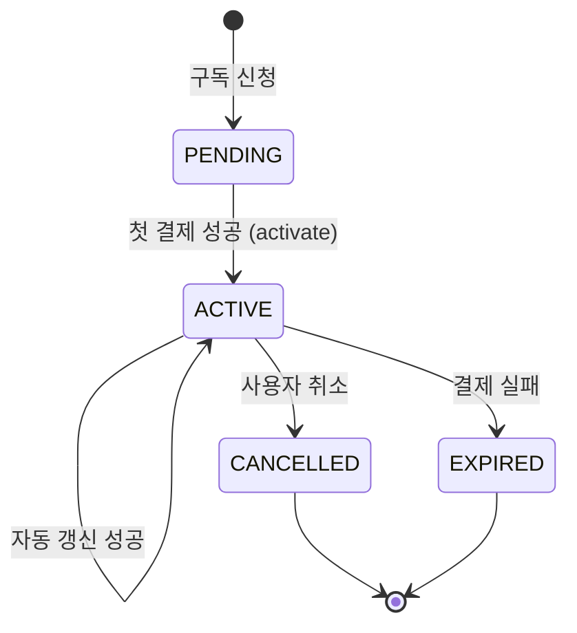

# 📋 비즈니스 로직 (Business Logic)

> **핵심 비즈니스 규칙과 데이터 흐름 정의 문서**

**Last updated:** 2026-03-08 (v3: 11-factor scoring, enrichment pipeline)

---

## 1. AI 예측 시스템 (Prediction Pipeline)

### 1.1 예측 생성 플로우



### 1.2 Python 분석 알고리즘 v2

> 상세: [ANALYSIS_SPEC.md](../specs/ANALYSIS_SPEC.md)

#### 말+기수 통합 점수 (calculate_score) — 12요소 정규화 가중합

> 가중치 합 = 1.0. `analysis.py` `W_HORSE` 딕셔너리 기준 (v3.1, 2026-03-08)

| 요소 | 가중치 | 설명 |
|------|--------|------|
| **레이팅** (rat) | 0.22 | sigmoid 상대비교(55%) + 로그 절대구간(45%) |
| **폼/기세** (frm) | 0.19 | 최근 5경기 가중평균 + 기세 추이(-6~+8) + 레이팅 추이 |
| **컨디션** (cnd) | 0.10 | 마체중 변화·연령(4~5세 전성기)·부담중량·성별(거세 +3) |
| **기수** (jky) | 0.09 | 경마장별 승률·복승률 직접 반영. 신인(100회 미만) ×0.85. 폴백(career-wide) ×0.90 |
| **적합도** (suit) | 0.07 | 각질×거리 매칭 + 주로상태(습/불/중) 영향 |
| **조교사** (trn) | 0.07 | 승률 보너스(max 35) + 복승률 보너스(max 25) |
| **경험** (exp) | 0.06 | 로그 스케일 출전횟수(0~50) + 승률 구간(0~50) |
| **거리별 성적** (dist) | 0.06 | 현재 거리 구간 승률/복승률 기반. 경험 적으면 평균 회귀 |
| **휴식 기간** (rest) | 0.04 | 최적 21-42일. <14일 피로, >90일 녹슬음 |
| **조교 준비도** (trng) | 0.04 | 최근 14일 세션 수, 강도, 빈도, 마지막 조교 경과일 |
| **클래스 변경** (cls) | 0.03 | 등급 하향 +15~+25pt, 등급 상향 -15~-25pt |
| **당일 다경주 피로** (sdf) | 0.03 | 같은 날 이전 경주 출전 횟수 기반. 0회=50(중립), 1회=30+gap보너스, 2회+=20이하 |
| 낙마 감점 | - | risk 50+ → ×0.88, 30+ → ×0.94, 20+ → ×0.97 |
| **winProb** | - | softmax(T=12) 기반 승률 확률(%) |

#### 기수 데이터 보강 전략

| 우선순위 | 데이터 소스 | 조건 |
|---------|-----------|------|
| 1 (primary) | `jockey_results` — 해당 경마장(meet) | jkNo + meet 일치 |
| 2 (fallback) | `jockey_results` — 전체 경마장 합산 | meet 불일치 또는 데이터 없음 |
| 3 (default) | 고정값 40.0 | DB에 기수 데이터 전혀 없음 |

폴백 합산: `winRateTsum = Σord1CntT / ΣrcCntT × 100`, `quRateTsum = Σ(ord1+ord2+ord3)CntT / ΣrcCntT × 100`

#### 기수 점수·가중치 (analyze_jockey — 2단계 필터)

| 항목 | 설명 |
|------|------|
| **weightRatio** | 혼전 50/50, 특수(비·습·장거리) 60/40, 일반 70/30 |
| **NestJS 통합** | `enrichEntriesWithJockeyResults()` → Python `_jockey_score()` 직접 반영 → softmax winProb. 상세: [BET_TYPE_ODDS_ALIGNMENT.md](../features/BET_TYPE_ODDS_ALIGNMENT.md) |

#### v3 신규 Enrichment Pipeline (predictions.service.ts)

| 메서드 | 데이터 소스 | 출력 필드 |
|--------|-----------|----------|
| `enrichEntriesWithRestPeriod()` | `race_results JOIN races` (MAX rcDate) | `daysSinceLastRace` |
| `enrichEntriesWithDistanceStats()` | `race_results JOIN races` (rcDist bracket) | `distWinRate`, `distPlaceRate`, `distRaceCount` |
| `enrichEntriesWithClassChange()` | `race_results JOIN races` (rank) | `classChange`, `classChangeLevel` |
| `enrichEntriesWithTrainingMetrics()` | `trainings` (recent 14 days) | `trainingMetrics` (sessionCount, highIntensityCount, daysSinceLastTraining, avgSessionsPerWeek) |

#### v3 Cron 추가

| 크론 | 스케줄 | 설명 |
|------|--------|------|
| `generatePreRacePredictions()` | 금/토/일 06:30 KST | 당일 경주 예측 자동 생성 (결과 배치 의존 제거) |

### 1.3 Gemini 프롬프트 구조 v3.1 (주관적 분석 + 실시간 지원)

```
[compact 입력 (~1500 토큰)]
- 경주 정보: meet, date, dist, rank, weather, track, cascade(10+)
- 출전마: n(번호), h(마명), j(기수), fs(통합점수), wp(승률%), hs(말점수), js(기수점수),
          sub([rat,frm,cnd,exp,trn,suit,jky,rest,dist,cls,trng,sdf]), r(레이팅), wg(마체중), rk(착순), risk(낙마), t(태그)
- Python이 처리한 raw 데이터(equipment, chaksun, ratingHistory 등)는 전송 제외

[분석 방침] — v3.1 추가
- 숫자 데이터 + 경마 전문가 주관적·정성적 분석 필수
- 기수-마필 궁합, 페이스 전개, 주로 바이어스, 날씨 영향, 마필 기질 고려
- 당일 다경주 출전마(sdf) 체중감소·피로 반영, 클래스 승강 주관 평가
- 승식 예측: 레이스 흐름·변수·이변 가능성 고려한 조합 추천

[규칙]
- sub 12요소+risk 수치 근거 + 주관적 판단으로 reason/strengths/weaknesses 작성
- risk 30+ → weaknesses에 낙마, cascade 20+ → analysis에 연쇄낙마
- analysis: 종합예측 6~10문장, 개별예측(realtime) 8~12문장. 서사적 분석, 숫자 나열 금지

[실시간 개별예측 추가 섹션] — realtime=true 시
- 마체중 급변 분석, 당일 실시간 기상 반영, 저평가마(가치마) 발굴

[출력] horseScores, betTypePredictions(7승식), analysis, preview
```

### 1.4 종합예측 vs 개별예측

| 구분 | 종합예측 (Matrix) | 개별예측 (Race Detail) |
|------|-------------------|----------------------|
| 생성 시점 | Cron/배치 사전 생성 | 사용자 RACE 티켓 사용 시 실시간 |
| KRA 데이터 | 사전 적재된 DB 데이터 | `refreshRaceDayRealtime()` 재조회 (마체중·날씨·장비·취소) |
| 캐시 | entriesHash 기반 재사용 | skipCache=true, 항상 새로 생성 |
| 프롬프트 | 기본 (analysis 6~10문장) | 실시간 강화 (analysis 8~12문장, 체중급변·기상·저평가마 분석) |
| 비용 | 배치 1회 Gemini 호출 | 티켓 사용마다 Gemini 호출 |
| 결과 | 모든 유저 동일 | 조회 시점 최신 데이터 반영 |
| 티켓 | MATRIX 티켓 | RACE 티켓 |

### 1.5 무료 vs 유료 콘텐츠

| 구분      | 무료 (preview)                      | 유료 (analysis)             |
| --------- | ----------------------------------- | --------------------------- |
| 접근 방식 | 예측권 불필요                       | 예측권 1장 소비             |
| 내용      | 상위 3마리 + 간단 코멘트            | 전체 분석글 + 상세 점수     |
| DB 필드   | `prediction.preview`                | `prediction.analysis`       |
| API       | `GET /predictions/race/:id/preview` | `GET /predictions/race/:id` |

### 1.6 Preview 검수 (previewApproved)

- `prediction.previewApproved` (Boolean): 관리자 검수 완료 시 `true` (예측 생성 시 자동 `true` 설정)
- **Preview API는 `previewApproved: true`이고 `status: COMPLETED`인 예측만 반환**
- **Matrix API는 `previewApproved` 무시** — 종합예상표는 유료 기능이므로 `status: COMPLETED`만 체크
- 검수 미통과 시 해당 경기 preview 데이터는 서버에서 전송하지 않음 (클라이언트에 미노출)

### 1.7 예측 성공 시 DB 저장 구조 (scores)

예측 생성 성공 시 `Prediction.scores`(Json)에 다음을 저장:

```json
{
  "horseScores": [
    { "hrName": "...", "hrNo": "...", "score": 85, "reason": "...", "strengths": ["..."], "weaknesses": ["..."] }
  ],
  "betTypePredictions": { "SINGLE": { ... }, "PLACE": { ... }, ... },
  "analysisData": {
    "horseScoreResult": [
      {
        "hrNo": "...", "score": 84.26,
        "sub": {"rat": 94.98, "frm": 88.71, "cnd": 80.0, "exp": 66.85, "trn": 82.4, "suit": 62.0, "jky": 55.0, "rest": 75.0, "dist": 60.0, "cls": 50.0, "trng": 65.0, "sdf": 50.0},
        "risk": 10, "winProb": 39.4,
        "tags": ["R상위82", "기세↑", "베테랑55전9승"]
      }
    ],
    "jockeyAnalysis": {
      "entriesWithScores": [ { "hrNo", "hrName", "jockeyScore", "combinedScore" } ],
      "weightRatio": { "horse": 0.7, "jockey": 0.3 },
      "topPickByJockey": { "hrName", "jkName", "jockeyScore" }
    }
  }
}
```

- `horseScores`: Gemini 결과 (API/UI 호환). reason, strengths, weaknesses 포함
- `horseScoreResult`: Python calculate_score v3.1 원본 (sub 12요소, risk, winProb, tags)
- `analysisData`: [ANALYSIS_SPEC.md](../specs/ANALYSIS_SPEC.md), [KRA_ANALYSIS_STRATEGY.md](../specs/KRA_ANALYSIS_STRATEGY.md) 참고
- 점수에 배당 반영(배당 있으면 finalScore 블렌딩). 배당·승식 원칙: [BET_TYPE_ODDS_ALIGNMENT.md](../features/BET_TYPE_ODDS_ALIGNMENT.md) 참고

### 1.7 예측 정확도 자동 업데이트

경주 결과 확정 시 (`ResultsService.bulkCreate`):

1. 해당 경주의 `Prediction`(COMPLETED) 조회
2. 예측 상위 3마리 vs 실제 결과 상위 3마리 비교 (hrNo 기준)
3. 일치 비율로 `Prediction.accuracy`(%) 계산 후 저장

### 1.8 경주 상태 (종료/예정)

- **종료(COMPLETED)** 는 KRA 결과 API로 결과가 DB에 적재된 경주에만 설정된다. 날짜가 지났다고 해서 COMPLETED로 바꾸지 않는다.
- **경주 종료 시점**: 발주 시각(stTime) + 10분을 "경주 종료"로 판단(한국마사회 기준). 경기 적재 시 `batch_schedules`에 경주별 종료 시각으로 결과 수집 job을 등록하고, 5분마다 due job을 실행해 해당 날짜 결과를 가져오면 해당 경주를 COMPLETED로 갱신. 상세: [DATA_LOADING.md](../DATA_LOADING.md) §경주 종료 판단 및 배치 스케줄.
- 클라이언트·API는 **DB의 `race.status`** 및 목록 API에서는 **결과 존재 여부(ordInt/ordType)** 로 종료/예정을 보정해 노출한다. 상세: [RACE_STATUS_AND_KRA.md](../features/RACE_STATUS_AND_KRA.md).

---

## 2. 예측권 시스템 (Prediction Ticket)

### 2.1 예측권 획득 방법



| 획득 방법      | 수량                       | 만료         |
| -------------- | -------------------------- | ------------ |
| 구독 (LIGHT/STANDARD/PREMIUM) | 플랜별: 라이트 10장, 스탠다드 20장, 프리미엄 30장 | 구독 기간 내 |
| 개별 구매      | 구매 수량                  | 30일 후 만료 |

### 2.2 예측권 사용 플로우



### 2.3 예측권 상태

```
AVAILABLE → (사용) → USED
AVAILABLE → (기간 만료) → EXPIRED
```

### 2.4 예측권 유형 (TicketType)

| 유형 | 설명 | 가격 | 대상 |
|------|------|------|------|
| `RACE` | 경주별 예측권 | 구독 포함 / 개별 구매 | 개별 경주 AI 예측 열람 |
| `MATRIX` | 종합 예측권 | 1,000원/장 | 일일 종합 예상표 열람 |

### 2.5 종합 예측권 (MATRIX) 비즈니스 규칙

#### 사용 규칙
- **1일 1장**: 하루에 1장 사용하면 해당 날짜의 전체 종합 예상표 열람 가능
- **중복 방지**: 같은 날짜에 이미 사용한 종합 예측권이 있으면 추가 소비 없이 접근 허용 (`alreadyUsed: true`)
- **날짜 포맷**: 서버 내부에서 `YYYYMMDD` 형식으로 정규화하여 `matrixDate` 필드에 저장

#### 접근 제어 플로우



#### 잠금 UI 규칙
- **미열람**: 3경주 미리보기 + 나머지 잠금 오버레이 (Lock 아이콘 + "나머지 N경주 예상 잠금")
- **열람 중**: 전체 예상표 오픈 + "열람 중" 골드 배지
- **미로그인**: `RequireLogin` 컴포넌트 표시

### 2.6 예측권 획득 방법

| 획득 방법      | 유형 | 수량                       | 만료         |
| -------------- | ---- | -------------------------- | ------------ |
| 구독 (LIGHT/STANDARD/PREMIUM) | RACE | 플랜별: 라이트 10장, 스탠다드 20장, 프리미엄 30장 | 구독 기간 내 |
| 구독 (STANDARD 이상) | MATRIX | 5,000원당 1장 (라이트=0, 스탠다드=1, 프리미엄=2) | 구독 기간 내 |
| 개별 구매      | RACE | 구매 수량                  | 30일 후 만료 |
| **포인트 구매**| RACE | 1장=1200pt                 | 30일 후 만료 |
| **종합 예측권 구매** | MATRIX | 1장=1,000원 (1~10장) | 30일 후 만료 |

### 2.7 일일/연속 로그인 보너스

- **일일 로그인 보너스**: 로그인 시 **해당일(KST) 최초 1회** 포인트 지급. `point_configs`의 `DAILY_LOGIN_BONUS_POINTS`(기본 10) 사용. `users.lastDailyBonusAt`으로 중복 방지.
- **연속 로그인 보상**: 매일 로그인 시 `users.lastConsecutiveLoginDate`(KST YYYY-MM-DD), `consecutiveLoginDays` 갱신. **7일 연속** 달성 시 RACE 예측권 1장 지급(30일 만료), 이후 streak 0으로 리셋. 7일 미만이면 다음 로그인 시 streak 유지/증가.
- 로그인 API 응답에 `loginBonus: { dailyBonusGranted, dailyBonusPoints, consecutiveDays, consecutiveRewardGranted }` 포함. 프로필/내 정보에 `consecutiveLoginDays` 노출.

---

## 3. 구독 시스템 (Subscription)

### 3.0 구독 플랜 (라이트 / 스탠다드 / 프리미엄)

| 플랜 | 표시명 | 예측권/월 | 비고 |
|------|--------|-----------|------|
| LIGHT | 라이트 | 10장 | 입문 |
| STANDARD | 스탠다드 | 20장 | 일반 |
| PREMIUM | 프리미엄 | 30장 (27+3 보너스) | 헤비 |

- 개별 구매: 1장 550원 (500원+10% VAT)

- Admin `/subscription-plans`에서 가격·티켓 수 수정 가능

### 3.1 구독 플로우



### 3.2 구독 결제 흐름

```
1. 사용자가 플랜 선택 → POST /subscriptions/subscribe
2. PG사에서 빌링키 발급 → POST /payments/subscribe
3. 첫 결제 성공 → PATCH /subscriptions/:id/activate
4. 예측권 자동 발급 (totalTickets만큼)
5. 매월 nextBillingDate에 자동 결제
6. 결제 성공 시 예측권 재발급 + nextBillingDate 갱신
```

### 3.3 구독 취소

```
- 사용자가 취소 → POST /subscriptions/cancel { reason? }
- 즉시 해지가 아닌, 현재 결제 기간 끝까지 유지
- cancelledAt 기록, status = CANCELLED
- 남은 예측권은 만료일까지 계속 사용 가능
```

---

## 4. 결제 시스템 (Payment)

### 4.1 결제 유형

| 유형      | API                        | 설명                  |
| --------- | -------------------------- | --------------------- |
| 구독 결제 | `POST /payments/subscribe` | 빌링키 발급 + 첫 결제 |
| 단건 결제 | `POST /payments/purchase`  | 예측권 개별 구매      |

### 4.2 결제 기록

모든 결제는 `BillingHistory` 테이블에 기록:

```
SUCCESS → 결제 성공
FAILED → 결제 실패 (errorMessage 저장)
REFUNDED → 환불 처리
```

---

## 5. 알림 시스템 (Notification)

### 5.1 알림 설정 (UserNotificationPreference)

사용자별 알림 수신 on/off를 플래그로 관리. **이메일 알림 없음.**

| 플래그               | 설명                   | 플랫폼 노출        |
| -------------------- | ---------------------- | ------------------ |
| `pushEnabled`        | 푸시 알림              | **mobile 전용**    |
| `raceEnabled`        | 경주 시작·결과         | web, mobile        |
| `predictionEnabled`  | AI 예측·예측권         | web, mobile        |
| `subscriptionEnabled`| 구독 결제·만료         | web, mobile        |
| `systemEnabled`      | 시스템 공지            | web, mobile        |
| `promotionEnabled`   | 프로모션·마케팅        | web, mobile        |

- **API**: `GET/PUT /api/notifications/preferences`
- **플랫폼 감지**: Mobile WebView가 `window.__IS_NATIVE_APP__=true` 주입 → webapp에서 푸시 토글만 mobile에 노출
- **문서**: [NOTIFICATION_SETTINGS.md](../features/NOTIFICATION_SETTINGS.md)

### 5.2 알림 유형 (Notification.type)

| Type           | 발생 시점                    |
| -------------- | ---------------------------- |
| `SYSTEM`       | 시스템 공지, 업데이트        |
| `RACE`         | 경기 시작 전 알림, 결과 발표 |
| `PREDICTION`   | AI 예측 완료 알림            |
| `PROMOTION`    | 프로모션, 할인 이벤트        |
| `SUBSCRIPTION` | 구독 갱신, 만료 예정 알림    |

### 5.3 알림 카테고리

| Category    | 설명                              |
| ----------- | --------------------------------- |
| `GENERAL`   | 일반 알림                         |
| `URGENT`    | 긴급 알림 (즉시 표시)             |
| `INFO`      | 정보성 알림                       |
| `MARKETING` | 마케팅 알림 (설정에서 끌 수 있음) |

---

## 6. 즐겨찾기 시스템 (Favorite)

### 6.1 즐겨찾기 — RACE(경기)만 지원

**현재 지원**: `RACE`만 사용. 말·기수·조교사 즐겨찾기 미지원.

| Type   | 대상 | targetId | 비고    |
| ------ | ---- | -------- | ------- |
| `RACE` | 경기 | Race ID  | ✅ 지원 |

### 6.2 토글 로직

```
POST /favorites/toggle { type: 'RACE', targetId, targetName }

→ 이미 존재? → 삭제 (REMOVED)
→ 존재하지 않음? → 생성 (ADDED)

Unique 제약: [userId, type, targetId]
DTO 검증: @IsIn(['RACE']) — type은 RACE만 허용
```

---

## 6.5 ~~내가 고른 말 (UserPick)~~ — **서비스에서 제외**

| 항목       | 설명                                                      |
| ---------- | --------------------------------------------------------- |
| 상태       | **제외** — WebApp/Mobile에서 메뉴·UI 미노출. Server API는 존재. |
| 원래 목적  | 승식별로 "내가 어떤 말을 골랐는지" 기록, 적중 시 포인트 지급 |
| Unique     | `[userId, raceId]` — 경주당 1개 선택                       |
| API        | `POST /picks`, `GET /picks`, `GET /picks/race/:raceId`, `DELETE /picks/race/:raceId` (미사용) |

### 6.6 포인트 시스템

| 구분       | 설명                                                      |
| ---------- | --------------------------------------------------------- |
| 적중 지급  | (내가 고른 말 제외) — 프로모션·이벤트 등으로 지급 가능    |
| 배율       | PointConfig (BASE_POINTS, SINGLE_MULTIPLIER 등)           |
| 예측권 구매| 포인트로 예측권 구매 (PointTicketPrice, 1장=1200pt)        |
| API        | `GET /points/me/balance`, `POST /points/purchase-ticket`, `GET /points/ticket-price` |

---

## 7. 랭킹 시스템 (Ranking)

### 7.1 랭킹 기준

- **(내가 고른 말 제외)** — 원래는 UserPick과 RaceResult 비교로 `correctCount` 계산. 현재는 랭킹 기준 별도 적용.
- 사행성 없음 — 베팅/배당 없이, "몇 번 맞췄는지" 기록만 랭킹으로 표시

### 7.2 랭킹 계산

```
각 유저의 UserPick 목록에서:
  - pickType (SINGLE, PLACE, QUINELLA 등)에 따라 적중 판정
  - 예: SINGLE → 1등 hrNo 일치, PLACE → 1~3등 포함, QUINELLA → 1·2등 (순서 무관) 등
  - 적중 시 correctCount +1

랭킹 = correctCount 내림차순 (많이 맞춘 유저가 상위)
```

---

## 8. 핵심 비즈니스 규칙 요약

| 규칙                         | 설명                                             |
| ---------------------------- | ------------------------------------------------ |
| **예측 = 돈벌기 수단 아님**  | 사행성 요소 없음. 분석 콘텐츠 제공 서비스        |
| **Gemini 비용 고정**         | Cron으로 미리 분석 → 사용자 수와 무관한 API 비용 |
| **예측권 없으면 미리보기만** | 무료 사용자도 preview 확인 가능 (검수 통과 예측만) |
| **종합 예상표 잠금**         | 종합 예측권 미사용 시 3경주 미리보기 + 나머지 잠금 |
| **종합 예측권 1일 1장**      | 같은 날짜 중복 사용 방지, 1장=1,000원             |
| **구독 취소 후 잔여 기간**   | 즉시 해지 아님. 결제 기간 끝까지 사용            |
| **개별 구매 예측권 만료**    | 30일 후 자동 만료                                |
| **포인트 구매 예측권**       | 1장=1200pt (현금과 별도 가격)                    |

---

_마지막 업데이트: 2026-02-19_
