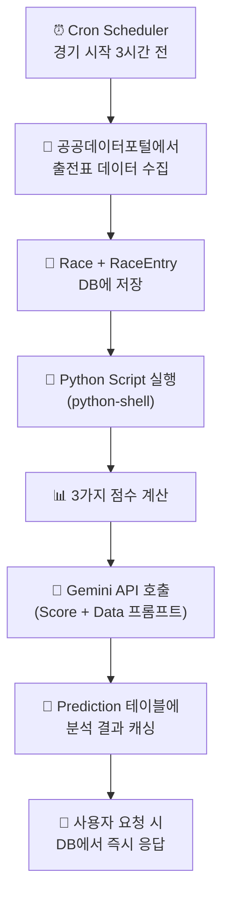
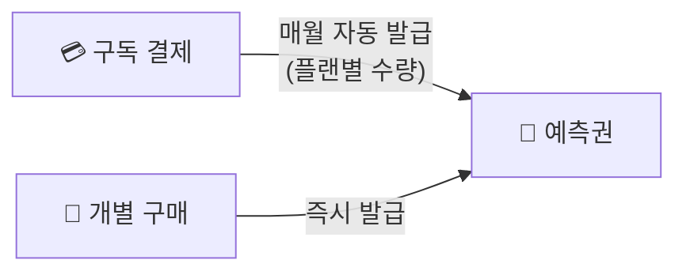
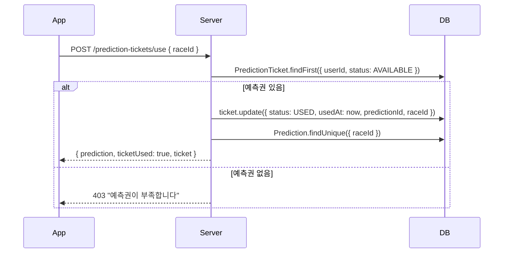
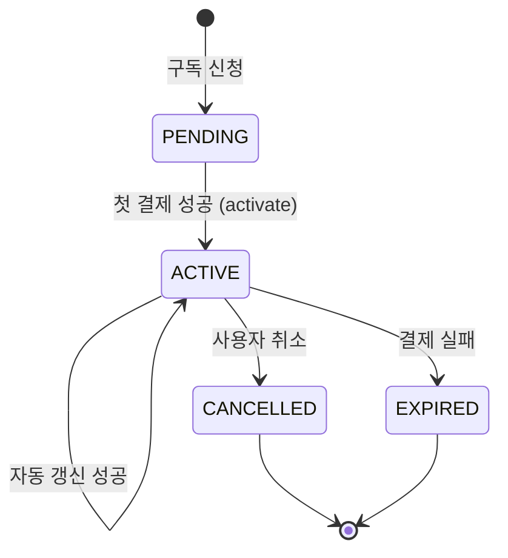

# 📋 비즈니스 로직 (Business Logic)

> **핵심 비즈니스 규칙과 데이터 흐름 정의 문서**

---

## 1. AI 예측 시스템 (Prediction Pipeline)

### 1.1 예측 생성 플로우



### 1.2 Python 분석 알고리즘 (3가지)

#### Speed Index (보정 주파 기록)

```
목적: 거리별/주로별 기록 편차 보정
입력: 경주 기록, 거리, 주로 상태
공식: 기준 시간 ÷ 실제 시간 × 100 (보정 계수 적용)
의미: 100 기준. 높을수록 빠른 말
```

#### Momentum Score (기세 지수)

```
목적: 최근 경기 트렌드 반영
입력: 최근 3경기 착순 (recentRanks)
공식: Σ(순위 점수 × 가중치)
  - 최근 1경기: 가중치 0.5
  - 최근 2경기: 가중치 0.3
  - 최근 3경기: 가중치 0.2
의미: 높을수록 상승세
```

#### Compatibility (기수-말 적합도)

```
목적: 기수와 말의 궁합 분석
입력: 해당 기수가 해당 말을 탔을 때의 과거 성적
공식: 해당 조합 승률 × 가중치 + 기수 전체 승률 × 보정값
의미: 높을수록 좋은 궁합
```

### 1.3 Gemini 프롬프트 구조

```
[시스템 프롬프트]
당신은 경마 분석 전문가입니다. 아래 데이터를 바탕으로 승부 예측을 작성하세요.

[데이터]
- 경기 정보: {race JSON}
- 출전마 목록: {entries JSON}
- Python 분석 결과: {scores JSON}

[요청]
1. 각 출전마의 강점/약점 분석
2. 상위 3마리 예측 (이유 포함)
3. 주의할 변수 (날씨, 주로 상태 등)
```

### 1.4 무료 vs 유료 콘텐츠

| 구분      | 무료 (preview)                      | 유료 (analysis)             |
| --------- | ----------------------------------- | --------------------------- |
| 접근 방식 | 예측권 불필요                       | 예측권 1장 소비             |
| 내용      | 상위 3마리 + 간단 코멘트            | 전체 분석글 + 상세 점수     |
| DB 필드   | `prediction.preview`                | `prediction.analysis`       |
| API       | `GET /predictions/race/:id/preview` | `GET /predictions/race/:id` |

### 1.5 Preview 검수 (previewApproved)

- `prediction.previewApproved` (Boolean): 관리자 검수 완료 시 `true`
- **Preview API는 `previewApproved: true`이고 `status: COMPLETED`인 예측만 반환**
- 검수 미통과 시 해당 경기 preview 데이터는 서버에서 전송하지 않음 (클라이언트에 미노출)

### 1.6 예측 성공 시 DB 저장 구조 (scores)

예측 생성 성공 시 `Prediction.scores`(Json)에 다음을 저장:

```json
{
  "horseScores": [ { "hrName": "...", "hrNo": "...", "score": 85, "reason": "..." } ],
  "analysisData": {
    "horseScoreResult": [ { "hrNo": "...", "score": 75 } ],
    "jockeyAnalysis": {
      "entriesWithScores": [ { "hrNo", "hrName", "jockeyScore", "combinedScore" } ],
      "weightRatio": { "horse": 0.7, "jockey": 0.3 },
      "topPickByJockey": { "hrName", "jkName", "jockeyScore" }
    }
  }
}
```

- `horseScores`: Gemini 결과 (API/UI 호환)
- `analysisData`: Python·기수 분석 원본 (정확도 계산·분석용) — [KRA_ANALYSIS_STRATEGY.md](../specs/KRA_ANALYSIS_STRATEGY.md) 참고

### 1.7 예측 정확도 자동 업데이트

경주 결과 확정 시 (`ResultsService.bulkCreate`):

1. 해당 경주의 `Prediction`(COMPLETED) 조회
2. 예측 상위 3마리 vs 실제 결과 상위 3마리 비교 (hrNo 기준)
3. 일치 비율로 `Prediction.accuracy`(%) 계산 후 저장

---

## 2. 예측권 시스템 (Prediction Ticket)

### 2.1 예측권 획득 방법



| 획득 방법      | 수량                       | 만료         |
| -------------- | -------------------------- | ------------ |
| 구독 (LIGHT)   | 플랜에 정의된 totalTickets | 구독 기간 내 |
| 구독 (PREMIUM) | 플랜에 정의된 totalTickets | 구독 기간 내 |
| 개별 구매      | 구매 수량                  | 30일 후 만료 |

### 2.2 예측권 사용 플로우



### 2.3 예측권 상태

```
AVAILABLE → (사용) → USED
AVAILABLE → (기간 만료) → EXPIRED
```

### 2.4 예측권 획득 방법 추가

| 획득 방법      | 수량                       | 만료         |
| -------------- | -------------------------- | ------------ |
| 구독 (LIGHT)   | 플랜에 정의된 totalTickets | 구독 기간 내 |
| 구독 (PREMIUM) | 플랜에 정의된 totalTickets | 구독 기간 내 |
| 개별 구매      | 구매 수량                  | 30일 후 만료 |
| **포인트 구매**| 1장=1200pt                 | 30일 후 만료 |

---

## 3. 구독 시스템 (Subscription)

### 3.1 구독 플로우



### 3.2 구독 결제 흐름

```
1. 사용자가 플랜 선택 → POST /subscriptions/subscribe
2. PG사에서 빌링키 발급 → POST /payments/subscribe
3. 첫 결제 성공 → PATCH /subscriptions/:id/activate
4. 예측권 자동 발급 (totalTickets만큼)
5. 매월 nextBillingDate에 자동 결제
6. 결제 성공 시 예측권 재발급 + nextBillingDate 갱신
```

### 3.3 구독 취소

```
- 사용자가 취소 → POST /subscriptions/cancel { reason? }
- 즉시 해지가 아닌, 현재 결제 기간 끝까지 유지
- cancelledAt 기록, status = CANCELLED
- 남은 예측권은 만료일까지 계속 사용 가능
```

---

## 4. 결제 시스템 (Payment)

### 4.1 결제 유형

| 유형      | API                        | 설명                  |
| --------- | -------------------------- | --------------------- |
| 구독 결제 | `POST /payments/subscribe` | 빌링키 발급 + 첫 결제 |
| 단건 결제 | `POST /payments/purchase`  | 예측권 개별 구매      |

### 4.2 결제 기록

모든 결제는 `BillingHistory` 테이블에 기록:

```
SUCCESS → 결제 성공
FAILED → 결제 실패 (errorMessage 저장)
REFUNDED → 환불 처리
```

---

## 5. 알림 시스템 (Notification)

### 5.1 알림 설정 (UserNotificationPreference)

사용자별 알림 수신 on/off를 플래그로 관리. **이메일 알림 없음.**

| 플래그               | 설명                   | 플랫폼 노출        |
| -------------------- | ---------------------- | ------------------ |
| `pushEnabled`        | 푸시 알림              | **mobile 전용**    |
| `raceEnabled`        | 경주 시작·결과         | web, mobile        |
| `predictionEnabled`  | AI 예측·예측권         | web, mobile        |
| `subscriptionEnabled`| 구독 결제·만료         | web, mobile        |
| `systemEnabled`      | 시스템 공지            | web, mobile        |
| `promotionEnabled`   | 프로모션·마케팅        | web, mobile        |

- **API**: `GET/PUT /api/notifications/preferences`
- **플랫폼 감지**: Mobile WebView가 `window.__IS_NATIVE_APP__=true` 주입 → webapp에서 푸시 토글만 mobile에 노출
- **문서**: [NOTIFICATION_SETTINGS.md](../features/NOTIFICATION_SETTINGS.md)

### 5.2 알림 유형 (Notification.type)

| Type           | 발생 시점                    |
| -------------- | ---------------------------- |
| `SYSTEM`       | 시스템 공지, 업데이트        |
| `RACE`         | 경기 시작 전 알림, 결과 발표 |
| `PREDICTION`   | AI 예측 완료 알림            |
| `PROMOTION`    | 프로모션, 할인 이벤트        |
| `SUBSCRIPTION` | 구독 갱신, 만료 예정 알림    |

### 5.3 알림 카테고리

| Category    | 설명                              |
| ----------- | --------------------------------- |
| `GENERAL`   | 일반 알림                         |
| `URGENT`    | 긴급 알림 (즉시 표시)             |
| `INFO`      | 정보성 알림                       |
| `MARKETING` | 마케팅 알림 (설정에서 끌 수 있음) |

---

## 6. 즐겨찾기 시스템 (Favorite)

### 6.1 즐겨찾기 — RACE(경기)만 지원

**현재 지원**: `RACE`만 사용. 말·기수·조교사 즐겨찾기 미지원.

| Type   | 대상 | targetId | 비고    |
| ------ | ---- | -------- | ------- |
| `RACE` | 경기 | Race ID  | ✅ 지원 |

### 6.2 토글 로직

```
POST /favorites/toggle { type: 'RACE', targetId, targetName }

→ 이미 존재? → 삭제 (REMOVED)
→ 존재하지 않음? → 생성 (ADDED)

Unique 제약: [userId, type, targetId]
DTO 검증: @IsIn(['RACE']) — type은 RACE만 허용
```

---

## 6.5 내가 고른 말 (UserPick) — 승식별 기록 + 포인트

| 항목       | 설명                                                      |
| ---------- | --------------------------------------------------------- |
| 목적       | 승식별로 "내가 어떤 말을 골랐는지" 기록, 적중 시 포인트 지급 |
| 사행성     | 없음. 가상 포인트만 사용, 예측권 구매용                   |
| Unique     | `[userId, raceId]` — 경주당 1개 선택                       |
| 필드       | `pickType`, `hrNos[]`, `hrNames[]`, `pointsAwarded`        |
| 승식       | SINGLE, PLACE, QUINELLA, EXACTA, QUINELLA_PLACE, TRIFECTA, TRIPLE |
| API        | `POST /picks`, `GET /picks`, `GET /picks/race/:raceId`, `DELETE /picks/race/:raceId` |

### 6.6 포인트 시스템

| 구분       | 설명                                                      |
| ---------- | --------------------------------------------------------- |
| 적중 지급  | 경주 결과 등록 시 UserPick 적중 여부 판정 → 포인트 지급   |
| 배율       | PointConfig (BASE_POINTS, SINGLE_MULTIPLIER 등)           |
| 예측권 구매| 포인트로 예측권 구매 (PointTicketPrice, 1장=1200pt)        |
| API        | `GET /points/me/balance`, `POST /points/purchase-ticket`, `GET /points/ticket-price` |

---

## 7. 랭킹 시스템 (Ranking)

### 7.1 랭킹 기준

- **UserPick(내가 고른 말)**과 **RaceResult**를 승식별로 비교하여 맞춘 횟수(`correctCount`) 계산
- 사행성 없음 — 베팅/배당 없이, "몇 번 맞췄는지" 기록만 랭킹으로 표시

### 7.2 랭킹 계산

```
각 유저의 UserPick 목록에서:
  - pickType (SINGLE, PLACE, QUINELLA 등)에 따라 적중 판정
  - 예: SINGLE → 1등 hrNo 일치, PLACE → 1~3등 포함, QUINELLA → 1·2등 (순서 무관) 등
  - 적중 시 correctCount +1

랭킹 = correctCount 내림차순 (많이 맞춘 유저가 상위)
```

---

## 8. 핵심 비즈니스 규칙 요약

| 규칙                         | 설명                                             |
| ---------------------------- | ------------------------------------------------ |
| **예측 = 돈벌기 수단 아님**  | 사행성 요소 없음. 분석 콘텐츠 제공 서비스        |
| **Gemini 비용 고정**         | Cron으로 미리 분석 → 사용자 수와 무관한 API 비용 |
| **예측권 없으면 미리보기만** | 무료 사용자도 preview 확인 가능 (검수 통과 예측만) |
| **구독 취소 후 잔여 기간**   | 즉시 해지 아님. 결제 기간 끝까지 사용            |
| **개별 구매 예측권 만료**    | 30일 후 자동 만료                                |
| **포인트 구매 예측권**       | 1장=1200pt (현금과 별도 가격)                    |

---

_마지막 업데이트: 2026-02-13_
