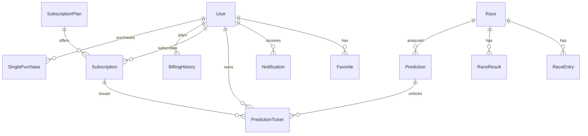

# 🗄️ 데이터베이스 스키마 (Database Schema)

> **Prisma ORM 기반 PostgreSQL 스키마. 파일: `server/prisma/schema.prisma`**  
> **KRA API 기준으로 정렬됨** (KRA_ENTRY_SHEET_SPEC, KRA_RACE_RESULT_SPEC, KRA_JOCKEY_RESULT_SPEC, KRA_TRAINING_SPEC)

---

## 스키마 전략: 마이그레이션 없음

- **schema가 default state** — column, default 값이 모두 schema에 정의됨
- **`prisma db push`** — schema → DB 반영 (마이그레이션 파일 생성 안 함)
- **`prisma/seed.sql`** — 초기 데이터 (PointConfig, PointTicketPrice, SubscriptionPlan, GlobalConfig, AdminUser)

```bash
# DB 초기화
cd server && npm run db:init
# 또는
npx prisma db push
psql $DATABASE_URL -f prisma/seed.sql
```

---

## ERD (Entity Relationship Diagram)



---

## 모델 상세

### 1. User (앱 사용자)

> 테이블명: `users` — 웹/모바일 회원 전용. Admin과 분리됨.

| 필드              | 타입          | 설명                   | 비고           |
| ----------------- | ------------- | ---------------------- | -------------- |
| `id`              | Int           | 고유 ID                | PK, auto increment |
| `email`           | String        | 이메일                 | unique         |
| `password`        | String        | 비밀번호 (bcrypt hash) |                |
| `name`            | String        | 이름                   |                |
| `nickname`        | String?       | 닉네임                 | optional       |
| `avatar`          | String?       | 프로필 이미지 URL      | optional       |
| `role`            | UserRole      | 역할                   | default: USER  |
| `isActive`        | Boolean       | 활성 상태              | default: true  |
| `isEmailVerified` | Boolean       | 이메일 인증 여부       | default: false |
| `lastLoginAt`     | DateTime?     | 마지막 로그인          |                |
| `createdAt`       | DateTime      | 생성일                 | auto           |
| `updatedAt`       | DateTime      | 수정일                 | auto           |

**관계:** Favorite[], Notification[], PredictionTicket[], Subscription[], BillingHistory[],
SinglePurchase[]

---

### 2. AdminUser (관리자)

> 테이블명: `admin_users` — Admin 패널 전용. User와 별도 테이블.

| 필드          | 타입          | 설명                   | 비고           |
| ------------- | ------------- | ---------------------- | -------------- |
| `id`          | Int           | 고유 ID                | PK, auto increment |
| `loginId`     | String        | 로그인 아이디          | unique         |
| `password`    | String        | 비밀번호 (bcrypt hash) | pgcrypto crypt |
| `name`        | String        | 이름                   |                |
| `isActive`    | Boolean       | 활성 상태              | default: true  |
| `lastLoginAt` | DateTime?     | 마지막 로그인          |                |
| `createdAt`   | DateTime      | 생성일                 | auto           |
| `updatedAt`   | DateTime      | 수정일                 | auto           |

**참고:** JWT/Guard의 `UserRole.ADMIN`은 DB 컬럼이 아님. Admin 로그인 시 응답에 role: 'ADMIN'을 포함.

---

### 3. Race (경기)

> 테이블명: `races`

| 필드          | 타입          | 설명        | 비고               |
| ------------- | ------------- | ----------- | ------------------ |
| `id`          | Int           | 고유 ID     | PK, auto increment  |
| `rcName`      | String?       | 경주명      | KRA                |
| `meet`        | String        | 시행경마장명 | 서울/제주/부산경남 |
| `meetName`    | String?       | 경마장 이름 |                    |
| `rcDate`      | String        | 경기 날짜   | YYYYMMDD           |
| `rcDay`       | String?       | 경주요일    | KRA                |
| `rcNo`        | String        | 경주 번호   |                    |
| `stTime`      | String?       | 출발시각    | KRA                |
| `rcDist`      | String?       | 거리 (m)    |                    |
| `rank`        | String?       | 등급조건    | KRA (rcGrade)      |
| `rcCondition` | String?       | 출전 조건   |                    |
| `rcPrize`     | Int?          | 1착상금     |                    |
| `weather`     | String?       | 날씨        |                    |
| `track`       | String?       | 주로상태    | KRA (trackState)   |
| `status`      | RaceStatus    | 경기 상태   | default: SCHEDULED |

**Unique:** `[meet, rcDate, rcNo]` **관계:** RaceEntry[], RaceResult[], Prediction[], UserPick[]

---

### 4. RaceEntry (출전마)

> 테이블명: `race_entries`

| 필드           | 타입          | 설명               | 비고                             |
| -------------- | ------------- | ------------------ | -------------------------------- |
| `id`           | String (UUID) | 고유 ID            | PK                               |
| `raceId`       | String        | 경기 FK            | → Race.id (CASCADE)               |
| `hrNo`         | String        | 마번               |                                  |
| `hrName`       | String        | 마명               |                                  |
| `jkName`       | String        | 기수명             |                                  |
| `trName`       | String?       | 조교사명           |                                  |
| `owName`       | String?       | 마주명             |                                  |
| `weight`       | Float?        | 부담 중량 (wgBudam)|                                  |
| `recentRanks`  | Json?         | 최근 등수 배열     | `[1, 5, 2]`                      |
| `equipment`    | String?       | 장구 내역          | KRA API24 (가면, 눈가리개 등)    |
| `horseWeight`  | String?       | 마체중             | KRA API25, 예: `"502(-2)"`       |
| `bleedingInfo` | Json?         | 폐출혈 이력        | bleCnt, bleDate, medicalInfo     |
| `isScratched`  | Boolean       | 출전취소 여부      | KRA API9, default: false         |

---

### 5. RaceResult (경주 결과)

> 테이블명: `race_results`

| 필드               | 타입          | 설명      | 비고                |
| ------------------ | ------------- | --------- | ------------------- |
| `id`               | String (UUID) | 고유 ID   | PK                  |
| `raceId`           | String        | 경기 FK   | → Race.id (CASCADE) |
| `ord`              | String?       | 순서      |                     |
| `hrNo`             | String        | 마번      |                     |
| `hrName`           | String        | 마명      |                     |
| `jkName`           | String?       | 기수명    |                     |
| `trName`           | String?       | 조교사명  |                     |
| `owName`           | String?       | 마주명    |                     |
| `rcRank`           | String?       | 착순      |                     |
| `rcTime`           | String?       | 기록 시간 |                     |
| `rcPrize`          | Int?          | 상금      |                     |
| `rcDist`           | String?       | 거리      |                     |
| `rcGrade`          | String?       | 등급      |                     |
| `rcCondition`      | String?       | 조건      |                     |
| `rcDay`            | String?       | 요일코드  |                     |
| `rcWeekday`        | String?       | 요일명    |                     |
| `rcWeather`        | String?       | 날씨      |                     |
| `rcTrack`          | String?       | 주로      |                     |
| `rcTrackCondition` | String?       | 주로 상태 |                     |

---

### 6. Prediction (AI 예측)

> 테이블명: `predictions`

| 필드       | 타입             | 설명             | 비고                     |
| ---------- | ---------------- | ---------------- | ------------------------ |
| `id`       | String (UUID)    | 고유 ID          | PK                       |
| `raceId`   | String           | 경기 FK          | → Race.id (CASCADE)      |
| `scores`   | Json?            | 점수 데이터      | `{ horseScores: [...] }` |
| `analysis` | String? (Text)   | AI 분석글 (유료) | Gemini 생성              |
| `preview`          | String? (Text)   | 무료 미리보기    | 요약본                   |
| `previewApproved`  | Boolean          | 검수 통과        | default: false — preview API 노출 조건 |
| `accuracy`         | Float?           | 예측 정확도      | 경기 종료 후 계산        |
| `status`           | PredictionStatus | 상태             | default: PENDING         |

---

### 7. PredictionTicket (예측권)

> 테이블명: `prediction_tickets`

| 필드             | 타입          | 설명      | 비고                 |
| ---------------- | ------------- | --------- | -------------------- |
| `id`             | String (UUID) | 고유 ID   | PK                   |
| `userId`         | String        | 사용자 FK | → User.id (CASCADE)  |
| `subscriptionId` | String?       | 구독 FK   | 구독으로 발급된 경우 |
| `predictionId`   | String?       | 예측 FK   | 사용된 예측          |
| `raceId`         | String?       | 경기 ID   | 사용된 경기          |
| `status`         | TicketStatus  | 상태      | default: AVAILABLE   |
| `usedAt`         | DateTime?     | 사용 일시 |                      |
| `issuedAt`       | DateTime      | 발급 일시 | auto                 |
| `expiresAt`      | DateTime      | 만료 일시 |                      |

---

### 8. SubscriptionPlan (구독 플랜)

> 테이블명: `subscription_plans`

| 필드            | 타입          | 설명             | 비고                    |
| --------------- | ------------- | ---------------- | ----------------------- |
| `id`            | String (UUID) | 고유 ID          | PK                      |
| `planName`      | String        | 플랜 코드        | unique (LIGHT, PREMIUM) |
| `displayName`   | String        | 표시명           |                         |
| `description`   | String?       | 설명             |                         |
| `originalPrice` | Int           | 원가             |                         |
| `vat`           | Int           | 부가세           |                         |
| `totalPrice`    | Int           | 총 가격          |                         |
| `baseTickets`   | Int           | 기본 예측권 수   |                         |
| `bonusTickets`  | Int           | 보너스 예측권 수 |                         |
| `totalTickets`  | Int           | 총 예측권 수     |                         |
| `isActive`      | Boolean       | 활성 여부        | default: true           |
| `sortOrder`     | Int           | 정렬 순서        | default: 0              |

---

### 9. Subscription (구독)

> 테이블명: `subscriptions`

| 필드              | 타입               | 설명          | 비고                  |
| ----------------- | ------------------ | ------------- | --------------------- |
| `id`              | String (UUID)      | 고유 ID       | PK                    |
| `userId`          | String             | 사용자 FK     | → User.id (CASCADE)   |
| `planId`          | String             | 플랜 FK       | → SubscriptionPlan.id |
| `price`           | Int                | 결제 금액     |                       |
| `status`          | SubscriptionStatus | 상태          | default: PENDING      |
| `billingKey`      | String?            | PG 빌링키     | 자동 결제용           |
| `nextBillingDate` | DateTime?          | 다음 결제일   |                       |
| `lastBilledAt`    | DateTime?          | 마지막 결제일 |                       |
| `startedAt`       | DateTime           | 시작일        |                       |
| `cancelledAt`     | DateTime?          | 취소일        |                       |
| `cancelReason`    | String?            | 취소 사유     |                       |

---

### 10. UserPick (내가 고른 말) — **서비스에서 제외**

> 테이블명: `user_picks` — WebApp/Mobile UI 미노출, API·스키마는 유지

| 필드           | 타입      | 설명                 | 비고                |
| -------------- | --------- | -------------------- | ------------------- |
| `id`           | String    | 고유 ID              | PK                  |
| `userId`       | String    | 사용자 FK            | → User.id (CASCADE) |
| `raceId`       | String    | 경기 FK              | → Race.id (CASCADE) |
| `pickType`     | PickType  | 승식                 | SINGLE, PLACE 등    |
| `hrNos`        | String[]  | 고른 마번 배열       | [1, 5] or [1, 5, 7] |
| `hrNames`      | String[]  | 마명 (표시용)        |                     |
| `pointsAwarded`| Int?      | 적중 시 지급 포인트  |                     |
| `createdAt`    | DateTime  | 생성일               |                     |

**Unique:** `[userId, raceId]`

### 11. PointConfig (포인트 설정)

> 테이블명: `point_configs`

| 필드        | 타입   | 설명           |
| ----------- | ------ | -------------- |
| `configKey` | String | BASE_POINTS 등 |
| `configValue`| String | 값             |

### 12. PointTicketPrice (포인트 예측권 가격)

> 테이블명: `point_ticket_prices`

| 필드             | 타입    | 설명        |
| ---------------- | ------- | ----------- |
| `pointsPerTicket`| Int     | 1장당 포인트|
| `isActive`       | Boolean | 활성 여부   |

### 13–15. 나머지 모델

| 모델                        | 테이블                         | 설명                                                                   |
| --------------------------- | ------------------------------ | ---------------------------------------------------------------------- |
| **Notification**            | `notifications`                | 알림 (SYSTEM/RACE/PREDICTION/PROMOTION/SUBSCRIPTION)                   |
| **UserNotificationPreference** | `user_notification_preferences` | 알림 설정 (push, race, prediction, subscription, system, promotion)     |
| **Favorite**                | `favorites`                    | 즐겨찾기 (RACE만 지원). Unique: [userId, type, targetId]                |
| **BillingHistory** | `billing_histories` | 결제 이력 (SUCCESS/FAILED/REFUNDED)                                    |
| **SinglePurchase** | `single_purchases`  | 개별 예측권 구매 기록                                                  |
| **PointTransaction** | `point_transactions` | 포인트 적립/사용 이력                                                |
| **GlobalConfig**     | `global_config`      | 글로벌 설정 (key-value, NoSQL 스타일). show_google_login 등          |
| **KraSyncLog**       | `kra_sync_logs`      | KRA API 동기화 로그 (endpoint, meet, rcDate, status, recordCount 등)  |

---

### UserNotificationPreference (알림 설정)

> 테이블명: `user_notification_preferences`

| 필드                 | 타입    | 설명                         | 비고              |
| -------------------- | ------- | ---------------------------- | ----------------- |
| `id`                 | String  | PK                           | UUID              |
| `userId`             | String  | 사용자 FK (unique)           | → User.id CASCADE |
| `pushEnabled`        | Boolean | 푸시 알림                    | default: true     |
| `raceEnabled`        | Boolean | 경주 알림                    | default: true     |
| `predictionEnabled`  | Boolean | AI 예측 알림                 | default: true     |
| `subscriptionEnabled`| Boolean | 구독 알림                    | default: true     |
| `systemEnabled`      | Boolean | 시스템 공지                  | default: true     |
| `promotionEnabled`   | Boolean | 프로모션 알림                | default: false    |
| `createdAt`          | DateTime| 생성일                       | auto              |
| `updatedAt`          | DateTime| 수정일                       | auto              |

**참고:** `pushEnabled` 토글은 mobile(native WebView)에서만 UI 노출. [NOTIFICATION_SETTINGS.md](../features/NOTIFICATION_SETTINGS.md)

---

### KraSyncLog (KRA API 동기화 로그)

> 테이블명: `kra_sync_logs`

| 필드          | 타입    | 설명                  |
| ------------- | ------- | --------------------- |
| `id`          | String  | PK                    |
| `endpoint`    | String  | API 엔드포인트        |
| `meet`        | String? | 경마장 코드 (1/2/3)   |
| `rcDate`      | String? | YYYYMMDD              |
| `status`      | String  | SUCCESS/FAILED/PARTIAL|
| `recordCount` | Int     | 처리 레코드 수        |
| `errorMessage`| Text?   | 에러 메시지           |
| `durationMs`  | Int?    | 소요 시간 (ms)        |
| `createdAt`   | DateTime| 생성일                |

---

### GlobalConfig (글로벌 설정)

> 테이블명: `global_config`

| 필드       | 타입          | 설명           |
| ---------- | ------------- | -------------- |
| `id`       | String (UUID) | PK             |
| `key`      | String        | 설정 키 (unique) |
| `value`    | String        | 설정 값 (JSON 또는 문자열) |
| `updatedAt`| DateTime      | 수정일         |

---

## Enum 목록

| Enum                   | 값                                                | 사용 모델        |
| ---------------------- | ------------------------------------------------- | ---------------- |
| `UserRole`             | USER, ADMIN                                       | User, JWT/Guard (AdminUser는 DB에 role 없음) |
| `RaceStatus`           | SCHEDULED, IN_PROGRESS, COMPLETED, CANCELLED      | Race             |
| `PredictionStatus`     | PENDING, PROCESSING, COMPLETED, FAILED            | Prediction       |
| `TicketStatus`         | AVAILABLE, USED, EXPIRED                          | PredictionTicket |
| `SubscriptionStatus`   | PENDING, ACTIVE, CANCELLED, EXPIRED               | Subscription     |
| `NotificationType`     | SYSTEM, RACE, PREDICTION, PROMOTION, SUBSCRIPTION | Notification     |
| `NotificationCategory` | GENERAL, URGENT, INFO, MARKETING                  | Notification     |
| `FavoriteType`         | HORSE, JOCKEY, TRAINER, RACE                      | Favorite         |
| `PaymentStatus`        | SUCCESS, FAILED, REFUNDED                         | BillingHistory   |
| `PickType`             | SINGLE, PLACE, QUINELLA, EXACTA, QUINELLA_PLACE, TRIFECTA, TRIPLE | UserPick |
