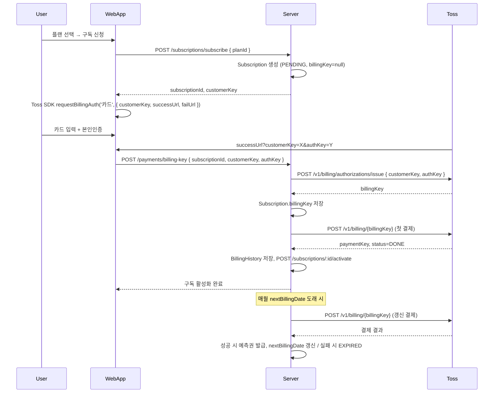

# 구독 결제 PG 연동 설계 — 토스페이먼츠

> 구독권 구매를 위한 카드 PG(토스페이먼츠) 연동 설계 및 구현 명세

---

## 1. 개요

- **PG**: 토스페이먼츠 (자동결제/빌링)
- **용도**: 구독 플랜 정기 결제 (첫 결제 + 매월 자동 갱신)
- **연동 방식**: 결제창(SDK)으로 카드 등록 → 서버에서 authKey로 빌링키 발급 → 빌링키로 자동결제 승인

### 1.1 전제 조건

- 토스페이먼츠 **자동결제(빌링) 계약** 필요. 미계약 시 `NOT_SUPPORTED_METHOD` 발생.
- 테스트: [개발자센터 테스트 키](https://developers.tosspayments.com/my/api-keys) 사용.
- 라이브: 상점 MID 기준 시크릿 키 사용.

---

## 2. 흐름 요약

---

## 3. API 설계

### 3.1 토스페이먼츠 호출 (서버)

| 용도           | Method | URL                                      | 비고 |
|----------------|--------|------------------------------------------|------|
| 빌링키 발급    | POST   | `https://api.tosspayments.com/v1/billing/authorizations/issue` | body: `customerKey`, `authKey` |
| 자동결제 승인  | POST   | `https://api.tosspayments.com/v1/billing/{billingKey}`         | body: `customerKey`, `amount`, `orderId`, `orderName`, `customerEmail`, `customerName`, `taxFreeAmount` |

- 인증: `Authorization: Basic base64(secretKey + ':')`
- Content-Type: `application/json`

### 3.2 서버 엔드포인트 (NestJS)

| Method | Route                          | 설명 | Auth |
|--------|---------------------------------|------|------|
| POST   | `/payments/billing-key`        | 결제창 성공 후 authKey로 빌링키 발급 및 구독에 저장 | 🔐 |
| POST   | `/payments/subscribe`          | (기존) 구독 결제 — 내부에서 첫 결제 + activate 연동 시 사용 | 🔐 |
| GET    | `/payments/history`            | (기존) 결제 이력 조회 | 🔐 |

### 3.3 클라이언트(WebApp)

- 구독 신청 시: `POST /subscriptions/subscribe { planId }` → `subscriptionId`, `customerKey` 수신.
- `customerKey`는 서버에서 UUID 등으로 생성해 구독 생성 시 함께 반환하거나, 클라이언트에서 생성해 전달.
- 결제창: `@tosspayments/payment-sdk` 또는 `https://js.tosspayments.com/v1/payment` 로 `requestBillingAuth('카드', { customerKey, successUrl, failUrl })` 호출.
- successUrl: 예) `https://my-domain.com/mypage/subscriptions/checkout/success?subscriptionId=:id` (서버가 subscriptionId 기준으로 customerKey 알 수 있음).
- success 페이지에서 쿼리 `customerKey`, `authKey` 추출 후 `POST /payments/billing-key { subscriptionId, customerKey, authKey }` 호출.
- 서버가 빌링키 발급 → 저장 → **첫 결제 요청** → 성공 시 **activate** 호출 후 클라이언트에 결과 반환.

---

## 4. 데이터베이스

- **Subscription**: `billingKey`, `customerKey` 필드 사용. (`customerKey` 컬럼 추가 마이그레이션: `20250225000000_add_subscription_customer_key`)
- **BillingHistory**: 기존 구조 유지. `pgProvider='TOSSPAYMENTS'`, `pgTransactionId`에 토스 `paymentKey` 또는 `orderId` 저장.

**DB 반영**: TypeORM 마이그레이션 적용 (`pnpm run migration:run`) 또는 `docs/db/schema.sql`에 맞춰 수동 DDL 적용 (로컬은 `./scripts/setup.sh`). 이미 스키마가 있으면 해당 마이그레이션은 건너뛰거나 `migration:run`으로 적용.

### 4.1 customerKey 정책

- **옵션 A**: 서버에서 구독 생성 시 `customerKey = uuid()` 생성 후 Subscription 메타(또는 별도 필드)에 저장하고 클라이언트에 내려줌. 결제창에서 이 값을 사용.
- **옵션 B**: 클라이언트에서 `customerKey` 생성 후 구독 신청 시 함께 전달. 서버는 구독과 customerKey를 매핑해 저장.
- 구현에서는 **옵션 A** 채택: 구독 생성 시 `customerKey` 생성해 응답에 포함. (DB에 저장하려면 Subscription에 `customerKey` 컬럼 추가)

---

## 5. 환경 변수

| 키 | 설명 | 예시 |
|----|------|------|
| `TOSSPAYMENTS_SECRET_KEY` | API 시크릿 키 (서버 전용, 노출 금지) | test_sk_... |
| `TOSSPAYMENTS_CLIENT_KEY` | 클라이언트 키 (결제창 SDK용, 웹에 노출 가능) | test_ck_... |
| `TOSSPAYMENTS_BILLING_SUCCESS_URL` | 빌링 성공 시 리다이렉트 URL (쿼리: customerKey, authKey) | https://.../checkout/success |
| `TOSSPAYMENTS_BILLING_FAIL_URL` | 빌링 실패 시 리다이렉트 URL | https://.../checkout/fail |

---

## 6. 에러 처리

- 토스 API 4xx/5xx: 메시지 추출 후 `BadRequestException` 또는 `InternalServerErrorException`으로 변환.
- 빌링키 발급 실패: 구독은 PENDING 유지, 클라이언트에 실패 사유 반환.
- 첫 결제 실패: 구독 PENDING 유지, 재시도는 클라이언트에서 빌링키 재발급 플로우부터.
- 정기 결제 실패: `BillingHistory`에 FAILED 기록, 구독 상태를 EXPIRED로 변경 후 알림(선택).

---

## 7. 정기 결제 스케줄러

- **주기**: `Subscription.nextBillingDate` 기준. 매일 00:00 UTC(또는 KST 09:00)에 "오늘 날짜가 nextBillingDate인 ACTIVE 구독" 조회.
- **로직**: 각 구독에 대해 `POST /v1/billing/{billingKey}` 호출 → 성공 시 예측권 발급, `nextBillingDate` += 30일, `lastBilledAt` 갱신, `BillingHistory` 저장. 실패 시 `status=EXPIRED`, `BillingHistory`에 FAILED 저장.
- **구현**: NestJS `@nestjs/schedule` + `Cron` 또는 기존 스케줄러 모듈 사용.

---

## 8. 체크리스트

- [x] 환경 변수 추가 (TOSSPAYMENTS_SECRET_KEY, TOSSPAYMENTS_CLIENT_KEY, success/fail URL)
- [x] 토스페이먼츠 빌링키 발급 API 클라이언트 (POST /v1/billing/authorizations/issue)
- [x] 토스페이먼츠 자동결제 승인 API 클라이언트 (POST /v1/billing/{billingKey})
- [x] POST /payments/billing-key (authKey → billingKey, 구독에 저장, 첫 결제 후 activate)
- [x] 구독 플로우: subscribe → (클라이언트 결제창) → billing-key → 첫 결제 → activate
- [x] BillingHistory에 pgProvider, pgTransactionId 저장
- [x] 정기 결제 크론: nextBillingDate 기준 결제 및 예측권 지급 (SubscriptionBillingScheduler)
- [x] WebApp: 결제창 연동, success/fail 페이지, customerKey 전달

---

## 9. 참고 링크

- [자동결제(빌링) 결제창 연동](https://docs.tosspayments.com/guides/billing/integration)
- [authKey로 빌링키 발급](https://docs.tosspayments.com/reference#authkey%EB%A1%9C-%EC%B9%B4%EB%93%9C-%EC%9E%90%EB%8F%99%EA%B2%B0%EC%A0%9C-%EB%B9%8C%EB%A7%81%ED%82%A4-%EB%B0%9C%EA%B8%89-%EC%9A%94%EC%B2%AD)
- [카드 자동결제 승인](https://docs.tosspayments.com/reference#%EC%B9%B4%EB%93%9C-%EC%9E%90%EB%8F%99%EA%B2%B0%EC%A0%9C-%EC%8A%B9%EC%9D%B8)
