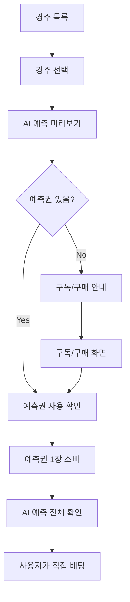

# 🎫 AI 예측권 시스템 완벽 가이드

**최종 업데이트**: 2025년 10월 15일  
**중요도**: ⭐⭐⭐ 핵심 비즈니스 로직

---

## 📋 목차

1. [AI 예측권이란?](#ai-예측권이란)
2. [사용자 플로우](#사용자-플로우)
3. [구현 아키텍처](#구현-아키텍처)
4. [API 명세](#api-명세)
5. [비즈니스 모델](#비즈니스-모델)
6. [모바일 UI 가이드](#모바일-ui-가이드)

---

## 🎯 AI 예측권이란?

### 정의

> **"이미 예정된 경주에 대해 AI가 미리 예측한 결과를 열람할 수 있는 티켓"**

### 핵심 개념 3가지

#### 1. AI 예측은 배치로 미리 생성

```
매일 09:00 (Cron Job)
└─ 당일 모든 경주 AI 예측 생성
   ├─ GPT-4o API 호출 (1회)
   ├─ Redis 캐싱
   └─ MySQL 저장
```

#### 2. 예측권 = 열람 권한

```
예측권 사용 → AI 예측 결과 확인 ✅
예측권 없음 → 미리보기만 가능 (블러 🔒)
```

#### 3. 베팅과는 별개

```
AI 예측 확인 → 사용자가 직접 베팅 (KRA 앱)
예측권 ≠ 베팅권
```

---

## 🔄 사용자 플로우

### Step-by-Step



### 화면 흐름

#### 1. 경주 목록 화면

```
┌─────────────────────────────┐
│ 📅 2025년 10월 15일        │
│                             │
│ 🏇 1경주 10:00             │
│    출전마: 12두            │
│    🤖 AI 예측 준비됨       │
│    [예측 보기 →]           │
│                             │
│ 🏇 2경주 11:00             │
│    출전마: 10두            │
│    🤖 AI 예측 준비됨       │
│    [예측 보기 →]           │
└─────────────────────────────┘
```

#### 2. AI 예측 미리보기 (블러)

```
┌─────────────────────────────┐
│ 🏇 1경주 - 서울 1400m       │
│                             │
│ 🤖 AI 예측 (신뢰도 87%)    │
│ ┌─────────────────────────┐ │
│ │ 🔒 블러 처리            │ │
│ │                         │ │
│ │ 1위 예상: ███████       │ │
│ │ 2위 예상: ███████       │ │
│ │ 3위 예상: ███████       │ │
│ │                         │ │
│ │ [🎫 예측권 사용하여    │ │
│ │   AI 예측 전체 보기]   │ │
│ │                         │ │
│ │ 남은 예측권: 5장        │ │
│ └─────────────────────────┘ │
└─────────────────────────────┘
```

#### 3. 예측권 사용 확인

```
┌─────────────────────────────┐
│ 🎫 예측권 사용 확인         │
│                             │
│ 예측권 1장을 사용하여       │
│ AI 예측을 확인하시겠습니까? │
│                             │
│ • 소비: 예측권 1장          │
│ • 남은 예측권: 5장 → 4장   │
│ • 유효기간: 2025-11-14까지 │
│                             │
│ [취소]  [확인]              │
└─────────────────────────────┘
```

#### 4. AI 예측 전체 확인 ✅

```
┌─────────────────────────────┐
│ 🤖 AI 예측 결과             │
│ 신뢰도: 87%                 │
│                             │
│ 🥇 1위 예상: 3번 썬더볼트   │
│    확률: 45% | 배당: 3.2   │
│                             │
│ 🥈 2위 예상: 7번 골든스타   │
│    확률: 30% | 배당: 4.5   │
│                             │
│ 🥉 3위 예상: 1번 블루윙     │
│    확률: 25% | 배당: 5.8   │
│                             │
│ 📊 추천 베팅 전략           │
│ • 단승: 3번 (안정적)        │
│ • 복승: 3-7 (추천)          │
│ • 연승식: 3-7-1 (공격적)    │
│                             │
│ [베팅하러 가기 (KRA 앱)]    │
└─────────────────────────────┘
```

---

## 🏗️ 구현 아키텍처

### 시스템 구성

```
┌─────────────────┐
│   모바일 앱     │
│ (React Native)  │
└────────┬────────┘
         │ API 호출
         ↓
┌─────────────────┐
│  NestJS Server  │
│  ┌───────────┐  │
│  │Controller │  │  → Ticket Guard (예측권 검증)
│  └─────┬─────┘  │
│        ↓        │
│  ┌───────────┐  │
│  │  Service  │  │
│  └─────┬─────┘  │
│        ↓        │
│  ┌───────────┐  │
│  │   Redis   │  │  → AI 예측 캐싱
│  └───────────┘  │
│        ↓        │
│  ┌───────────┐  │
│  │   MySQL   │  │  → 예측권 & 예측 저장
│  └───────────┘  │
└─────────────────┘
         ↑
         │ Cron Job (매일 09:00)
         │
┌─────────────────┐
│  Batch Service  │
│  ┌───────────┐  │
│  │ OpenAI    │  │  → GPT-4o API 호출
│  │ GPT-4o    │  │
│  └───────────┘  │
└─────────────────┘
```

### 데이터 흐름

#### 1. 배치 예측 생성 (09:00)

```typescript
// ai-batch.service.ts
@Cron('0 9 * * *')
async generateDailyPredictions() {
  const races = await this.racesService.getRacesToday();

  for (const race of races) {
    // 1. AI 예측 생성
    const prediction = await this.llmService.predict(race);

    // 2. Redis 캐싱
    await this.redis.set(
      `prediction:${race.id}`,
      JSON.stringify(prediction),
      'EX',
      86400 // 24시간
    );

    // 3. MySQL 저장
    await this.predictionsRepo.save(prediction);
  }
}
```

#### 2. 예측권 사용 (사용자 요청)

```typescript
// predictions.controller.ts
@Get('race/:raceId')
@UseGuards(TicketRequiredGuard) // 예측권 필수
async findByRace(
  @Param('raceId') raceId: string,
  @UseTicket() ticket: PredictionTicket
) {
  // 1. AI 예측 확인 (배치로 생성됨)
  const prediction = await this.predictionsService.findByRaceId(raceId);

  if (!prediction) {
    return { status: 'pending', message: '아직 생성 안됨' };
  }

  // 2. 예측권 소비
  ticket.use(raceId, prediction.id);
  await this.ticketsService.save(ticket);

  // 3. AI 예측 반환
  return {
    ...prediction,
    ticketUsed: true,
    message: 'AI 예측 열람 완료',
  };
}
```

---

## 📡 API 명세

### 1. AI 예측 미리보기 (예측권 불필요)

**Endpoint**: `GET /api/predictions/race/:raceId/preview`  
**Auth**: JWT 필수  
**Ticket**: 불필요

#### Request

```http
GET /api/predictions/race/20251015-01-001/preview
Authorization: Bearer {token}
```

#### Response (예측 있음)

```json
{
  "hasPrediction": true,
  "raceId": "20251015-01-001",
  "confidence": 0.87,
  "predictedAt": "2025-10-15T09:15:00Z",
  "requiresTicket": true,
  "message": "🎫 예측권을 사용하여 AI 예측 전체를 확인하세요",
  "previewText": "이 경주에 대한 AI 예측이 준비되었습니다. (신뢰도: 87.0%)"
}
```

#### Response (예측 없음)

```json
{
  "hasPrediction": false,
  "status": "pending",
  "message": "해당 경주에 대한 AI 예측이 아직 생성되지 않았습니다.",
  "raceId": "20251015-01-001"
}
```

### 2. AI 예측 열람 (예측권 필수)

**Endpoint**: `GET /api/predictions/race/:raceId`  
**Auth**: JWT 필수  
**Ticket**: 필수 (TicketRequiredGuard)

#### Request

```http
GET /api/predictions/race/20251015-01-001
Authorization: Bearer {token}
```

#### Response (성공)

```json
{
  "id": "pred_abc123",
  "raceId": "20251015-01-001",
  "confidence": 0.87,
  "predictedRanking": [
    {
      "rank": 1,
      "horseNumber": 3,
      "horseName": "썬더볼트",
      "probability": 0.45,
      "odds": 3.2
    },
    {
      "rank": 2,
      "horseNumber": 7,
      "horseName": "골든스타",
      "probability": 0.3,
      "odds": 4.5
    },
    {
      "rank": 3,
      "horseNumber": 1,
      "horseName": "블루윙",
      "probability": 0.25,
      "odds": 5.8
    }
  ],
  "recommendations": {
    "win": [3],
    "place": [3, 7],
    "quinella": [[3, 7]],
    "exacta": [
      [3, 7],
      [7, 3]
    ]
  },
  "reasoning": "3번 썬더볼트는 최근 3경주 연속 입상하며...",
  "ticketUsed": true,
  "ticketId": "ticket_xyz789",
  "message": "AI 예측 열람 완료"
}
```

#### Response (예측권 없음)

```json
{
  "statusCode": 400,
  "message": "사용 가능한 예측권이 없습니다. 구독 또는 개별 구매를 통해 예측권을 획득하세요.",
  "error": "Bad Request"
}
```

### 3. 예측권 잔액 조회

**Endpoint**: `GET /api/prediction-tickets/balance`  
**Auth**: JWT 필수

#### Request

```http
GET /api/prediction-tickets/balance
Authorization: Bearer {token}
```

#### Response

```json
{
  "userId": "user_123",
  "availableTickets": 5,
  "usedTickets": 15,
  "expiredTickets": 2,
  "totalTickets": 22
}
```

### 4. 예측권 사용 내역

**Endpoint**: `GET /api/prediction-tickets/history`  
**Auth**: JWT 필수

#### Request

```http
GET /api/prediction-tickets/history?limit=10&offset=0
Authorization: Bearer {token}
```

#### Response

```json
{
  "items": [
    {
      "id": "ticket_001",
      "status": "USED",
      "raceId": "20251015-01-001",
      "usedAt": "2025-10-15T10:30:00Z",
      "predictionId": "pred_abc123",
      "source": "subscription",
      "expiresAt": "2025-11-14T00:00:00Z"
    },
    {
      "id": "ticket_002",
      "status": "AVAILABLE",
      "source": "single_purchase",
      "issuedAt": "2025-10-15T09:00:00Z",
      "expiresAt": "2025-11-14T00:00:00Z"
    }
  ],
  "total": 22,
  "limit": 10,
  "offset": 0
}
```

---

## 💰 비즈니스 모델

### 구독 플랜

| 플랜        | 월 가격 | 예측권 | 일평균 | 유효기간 |
| ----------- | ------- | ------ | ------ | -------- |
| **Light**   | ₩9,900  | 30장   | 1장    | 30일     |
| **Premium** | ₩29,900 | 100장  | 3.3장  | 30일     |

### 개별 구매

- **₩3,000** → 예측권 10장 (30일 유효)
- **₩10,000** → 예측권 35장 (30일 유효, 17% 할인)

### 수익 시뮬레이션 (월 100명 구독)

```
Light: 70명 × ₩9,900 = ₩693,000
Premium: 30명 × ₩29,900 = ₩897,000
개별 구매: 20건 × ₩3,000 = ₩60,000
──────────────────────────────────
월 총 수익: ₩1,650,000

비용:
- Railway (서버+DB+Redis): ₩54,160
- OpenAI API: ₩7,500 (캐싱 99% 절감)
- Cloudflare: ₩0 (무료)
──────────────────────────────────
월 순이익: ₩1,588,340

마진율: 96.3% 🎉
```

---

## 📱 모바일 UI 가이드 (Week 4)

### 컴포넌트 구조

```
RaceListScreen
└─ RaceCard (각 경주)
   └─ AIPredictionBadge (🤖 AI 예측 준비됨)

RaceDetailScreen
├─ RaceInfo (경주 정보)
├─ HorseList (출전마)
├─ AIPredictionPreview (미리보기, 블러)
│  ├─ ConfidenceBadge (신뢰도)
│  └─ UnlockButton (예측권 사용)
└─ BettingHistory (내 베팅 기록)

AIPredictionDetailScreen
├─ PredictionHeader (신뢰도, 생성 시간)
├─ RankingList (1/2/3위 예상)
│  └─ HorsePredictionCard
│     ├─ HorseInfo
│     ├─ ProbabilityBar
│     └─ OddsDisplay
├─ RecommendationSection (추천 베팅)
└─ ReasoningSection (AI 분석 근거)
```

### 주요 컴포넌트 예시

#### 1. AIPredictionPreview.tsx

```tsx
import React from 'react';
import { View, Text, TouchableOpacity } from 'react-native';
import { BlurView } from 'expo-blur';
import { usePredictionPreview } from '@/hooks/usePredictions';

interface Props {
  raceId: string;
  onUnlock: () => void;
}

export function AIPredictionPreview({ raceId, onUnlock }: Props) {
  const { data: preview, isLoading } = usePredictionPreview(raceId);

  if (isLoading) return <LoadingSpinner />;

  if (!preview?.hasPrediction) {
    return <InfoBanner icon='time'>AI 예측이 아직 생성되지 않았습니다.</InfoBanner>;
  }

  return (
    <Card>
      <View style={styles.header}>
        <Text style={styles.title}>🤖 AI 예측</Text>
        <ConfidenceBadge value={preview.confidence} />
      </View>

      <BlurView intensity={80} style={styles.blurContainer}>
        <Text style={styles.blurText}>1위 예상: ███████</Text>
        <Text style={styles.blurText}>2위 예상: ███████</Text>
        <Text style={styles.blurText}>3위 예상: ███████</Text>
      </BlurView>

      <Button onPress={onUnlock} variant='primary'>
        🎫 예측권 사용하여 AI 예측 전체 보기
      </Button>

      <Text style={styles.ticketInfo}>남은 예측권: {ticketBalance}장</Text>
    </Card>
  );
}
```

#### 2. UnlockConfirmDialog.tsx

```tsx
import React from 'react';
import { Modal, View, Text } from 'react-native';
import { useTicketBalance } from '@/hooks/useTickets';

interface Props {
  visible: boolean;
  onClose: () => void;
  onConfirm: () => void;
}

export function UnlockConfirmDialog({ visible, onClose, onConfirm }: Props) {
  const { data: balance } = useTicketBalance();

  return (
    <Modal visible={visible} transparent>
      <View style={styles.overlay}>
        <Card style={styles.dialog}>
          <Text style={styles.title}>🎫 예측권 사용 확인</Text>

          <Text style={styles.message}>예측권 1장을 사용하여 AI 예측을 확인하시겠습니까?</Text>

          <View style={styles.infoBox}>
            <InfoRow label='소비' value='예측권 1장' />
            <InfoRow
              label='남은 예측권'
              value={`${balance.available}장 → ${balance.available - 1}장`}
            />
            <InfoRow label='유효기간' value='2025-11-14까지' />
          </View>

          <View style={styles.buttons}>
            <Button onPress={onClose} variant='secondary'>
              취소
            </Button>
            <Button onPress={onConfirm} variant='primary'>
              확인
            </Button>
          </View>
        </Card>
      </View>
    </Modal>
  );
}
```

#### 3. AIPredictionDetailScreen.tsx

```tsx
import React from 'react';
import { ScrollView, View, Text } from 'react-native';
import { usePrediction } from '@/hooks/usePredictions';

interface Props {
  predictionId: string;
}

export function AIPredictionDetailScreen({ predictionId }: Props) {
  const { data: prediction, isLoading } = usePrediction(predictionId);

  if (isLoading) return <LoadingSpinner />;

  return (
    <ScrollView style={styles.container}>
      {/* 헤더 */}
      <Card>
        <View style={styles.header}>
          <Text style={styles.title}>🤖 AI 예측 결과</Text>
          <ConfidenceBadge value={prediction.confidence} />
        </View>
        <Text style={styles.timestamp}>{formatDate(prediction.predictedAt)}</Text>
      </Card>

      {/* 순위 예측 */}
      <Section title='예상 순위'>
        {prediction.predictedRanking.map((horse, index) => (
          <HorsePredictionCard key={horse.horseNumber} rank={index + 1} horse={horse} />
        ))}
      </Section>

      {/* 추천 베팅 */}
      <Section title='📊 추천 베팅 전략'>
        <RecommendationCard recommendations={prediction.recommendations} />
      </Section>

      {/* AI 분석 근거 */}
      <Section title='🧠 AI 분석 근거'>
        <Text style={styles.reasoning}>{prediction.reasoning}</Text>
      </Section>

      {/* 베팅하러 가기 */}
      <Button onPress={() => Linking.openURL('kra://bet')} variant='primary' fullWidth>
        베팅하러 가기 (KRA 앱)
      </Button>
    </ScrollView>
  );
}
```

---

## 🎯 다음 단계 (Week 4)

### 개발 체크리스트

#### 백엔드 (완료 ✅)

- [x] AI 예측 배치 생성 (Cron)
- [x] 예측권 시스템 (발급/사용/만료)
- [x] 예측 미리보기 API
- [x] 예측 열람 API (예측권 필수)
- [x] 예측권 잔액 조회 API
- [x] 예측권 사용 내역 API

#### 프론트엔드 (TODO 📝)

- [ ] 경주 상세 화면 리팩토링
- [ ] AI 예측 미리보기 컴포넌트
- [ ] 예측권 사용 확인 다이얼로그
- [ ] AI 예측 상세 화면
- [ ] 예측권 잔액 표시 (TicketBadge)
- [ ] 예측권 구매 안내 화면

#### 테스트 (TODO 🧪)

- [ ] 배치 예측 생성 테스트
- [ ] 예측권 사용 플로우 E2E 테스트
- [ ] 예측권 소진 시나리오 테스트
- [ ] 미리보기 → 열람 전환 테스트

---

**✅ AI 예측권 시스템 가이드 완성!**

이제 Week 4 개발을 시작할 준비가 완료되었습니다. 🚀
