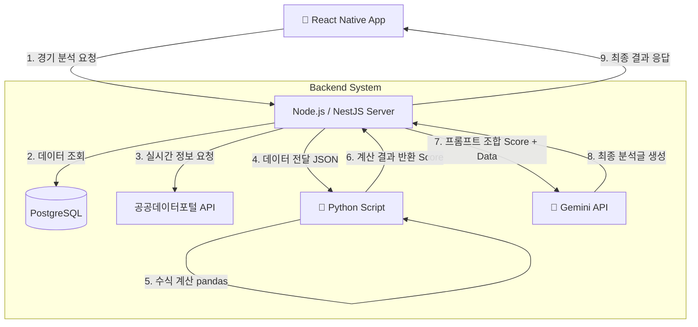

# 🐎 경마 승부예측 서비스 (Horse Racing AI Predictor) 기술 명세서

## 1. 프로젝트 개요

- **목표:** 공공데이터포털의 실시간 경마 정보를 활용하여, **수학적 데이터 분석(Python)**과 **생성형
  AI(Gemini)**의 추론 능력을 결합한 승부 예측 앱 서비스 개발.
- **핵심 가치:** 단순한 데이터 나열이 아닌, "왜 이 말이 우승할 가능성이 높은지"에 대한 **AI 분석
  코멘트**와 **자체 알고리즘 점수** 제공.
- **개발자:** 1인 풀스택 개발 (App + Server + AI)

## 2. 기술 스택 (Tech Stack) : T-N-P-P 전략

익숙한 JavaScript 생태계를 기반으로, 분석에 필요한 Python만 최소한으로 연동하는 하이브리드 구조.

| 구분         | 기술 (Technology)                | 선정 이유                                                     |
| ------------ | -------------------------------- | ------------------------------------------------------------- |
| **App**      | **React Native (Expo)**          | Cross-platform 개발 용이, 빠른 빌드 및 배포                   |
| **Backend**  | **NestJS (Node.js)**             | 안정적인 API 서버, Python 스크립트 실행 관리(Control Tower)   |
| **Analysis** | **Python**                       | `pandas`, `numpy`를 활용한 고성능 통계 연산 및 수치 해석      |
| **Database** | **PostgreSQL**                   | 경마 데이터(경기-말-기수)의 복잡한 관계형 데이터 처리에 최적  |
| **ORM**      | **Prisma**                       | DB 스키마 관리 용이, TypeScript와의 완벽한 호환               |
| **AI**       | **Google Gemini API**            | 분석된 수치를 바탕으로 최종 승부 예측 코멘트 생성 (Reasoning) |
| **Infra**    | **Railway** or **AWS Lightsail** | Node.js + Python + DB를 저렴하게 한 곳에서 운영 가능          |

## 3. 시스템 아키텍처 (System Architecture)



## 4. 데이터 흐름 및 구현 상세

### A. 백엔드 구조 (NestJS + Python)

- **역할 분담:**
  - **NestJS:** API 요청 처리, DB 관리, Python 스크립트 실행 (`python-shell` 사용).
  - **Python:** 순수 계산 모듈. DB 접근 없이 NestJS가 주는 JSON만 받아서 처리 후 반환.

### B. 주요 알고리즘 (Python 처리)

1. **보정 주파 기록 (Speed Index):** 거리별/주로별 기록 편차 보정.
2. **기세 지수 (Momentum Score):** 최근 3경기 가중치 적용.
3. **적합도 (Compatibility):** 기수와 말의 승률 매칭 분석.

### C. 디렉토리 구조 예시

```bash
server/
├── src/
│   ├── app.module.ts
│   ├── race/           # 경기 정보 모듈
│   ├── prediction/     # 예측 로직 모듈
│   │   ├── prediction.service.ts  # Python 실행 및 Gemini 호출
│   │   └── prediction.controller.ts
│   └── prisma/         # Prisma 서비스
├── scripts/            # 🐍 Python 분석 스크립트 모음
│   ├── analysis.py     # 메인 분석 로직
│   └── requirements.txt # pandas, numpy 등 의존성
├── prisma/
│   └── schema.prisma   # DB 스키마 정의
└── package.json
```

## 5. 데이터베이스 스키마 (Prisma Schema 초안)

```prisma
// schema.prisma

model Race {
  id          Int         @id @default(autoincrement())
  raceDate    DateTime    // 경기 날짜
  location    String      // 서울/부산/제주
  raceNumber  Int         // 제 1경주, 2경주...
  distance    Int         // 1200m
  weather     String?     // 날씨
  trackState  String?     // 주로 상태 (건조/포화 등)

  horses      RaceEntry[] // 출전마 리스트
}

model RaceEntry {
  id          Int     @id @default(autoincrement())
  raceId      Int
  horseName   String
  jockeyName  String
  weight      Float   // 부담 중량
  recentRanks Json    // 최근 등수 배열 [1, 5, 2]

  // 분석 결과 (AI 예측 후 저장)
  aiScore     Float?  // Python이 계산한 점수
  aiComment   String? // Gemini가 쓴 코멘트

  race        Race    @relation(fields: [raceId], references: [id])
}
```

## 6. 개발 로드맵 (Development Roadmap)

### Phase 1: 기초 공사 (Week 1)

- [ ] NestJS 프로젝트 생성 및 PostgreSQL 연동 (Prisma).
- [ ] 공공데이터포털 API 키 발급 및 `axios`로 데이터 호출 테스트.
- [ ] `Race`, `RaceEntry` 테이블에 데이터 저장 로직 구현.

### Phase 2: 분석 엔진 탑재 (Week 2)

- [ ] Python 설치 및 `pandas` 환경 설정.
- [ ] `scripts/analysis.py` 작성 (입력받은 JSON으로 점수 계산).
- [ ] NestJS에서 `python-shell`로 Python 스크립트 연동 테스트.

### Phase 3: AI 두뇌 장착 (Week 3)

- [ ] Google Gemini API 키 발급.
- [ ] 프롬프트 엔지니어링: "이 데이터를 바탕으로 분석해줘" + Python 결과값 포함.
- [ ] API 응답 속도 최적화 (필요시 캐싱 적용).

### Phase 4: 앱 개발 및 배포 (Week 4)

- [ ] React Native (Expo) 프로젝트 생성.
- [ ] 경기 목록 -> 상세 화면 -> 예측 결과 UI 구현.
- [ ] Railway 또는 AWS Lightsail에 서버 배포.

---

## 💡 개발 팁 (Tips)

1. **데이터 수집:** 경마가 없는 평일에 개발할 때는 과거 데이터를 미리 DB에 넣어두고 테스트하세요.
2. **타입 공유:** NestJS의 DTO(Data Transfer Object)를 프론트엔드와 공유하면 개발 속도가 빨라집니다.
3. **에러 처리:** 공공데이터 API가 자주 죽거나 느릴 수 있습니다. `try-catch` 및 재시도(Retry) 로직을
   꼼꼼히 넣으세요.
