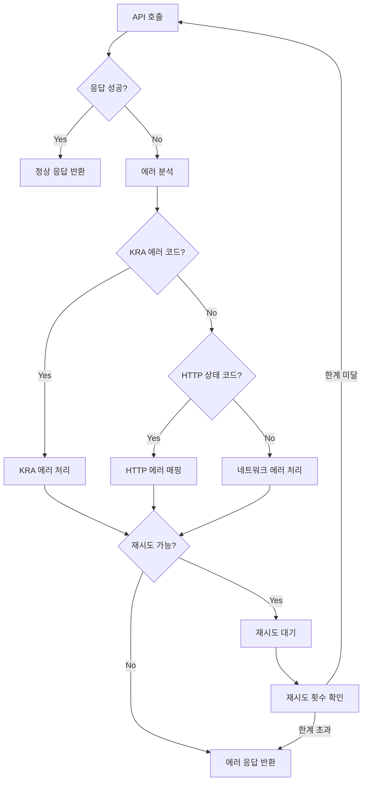

# 에러 핸들링 시스템 가이드

## 🎯 개요

Golden Race 프로젝트의 체계적이고 확장 가능한 에러 처리 시스템입니다. 특히 KRA API 연동에서 발생할 수 있는 다양한 에러 상황을 효과적으로 처리합니다.

## 🏗️ 아키텍처

### 계층별 에러 처리

```
┌─────────────────┐
│   Controller    │ ← HTTP 에러 응답
├─────────────────┤
│    Service      │ ← 비즈니스 로직 에러
├─────────────────┤
│  Error Handler  │ ← 전용 에러 처리기
├─────────────────┤
│  External API   │ ← 외부 API 에러
└─────────────────┘
```

## 📊 KRA API 에러 코드 체계

### 에러 코드 분류

| 카테고리           | 코드       | 설명          | 재시도 | 지연시간 |
| ------------------ | ---------- | ------------- | ------ | -------- |
| **AUTHENTICATION** | 30, 31, 32 | 인증 관련     | ❌     | -        |
| **RATE_LIMIT**     | 22         | 요청 제한     | ✅     | 24시간   |
| **VALIDATION**     | 10         | 파라미터 검증 | ❌     | -        |
| **SERVICE**        | 12, 20     | 서비스 관련   | ❌     | -        |
| **SYSTEM**         | 1, 99      | 시스템 에러   | ✅     | 5분      |

### 상세 에러 코드

#### 1. 인증 관련 에러 (AUTHENTICATION)

```typescript
SERVICE_KEY_IS_NOT_REGISTERED_ERROR: {
  code: '30',
  message: 'SERVICE_KEY_IS_NOT_REGISTERED_ERROR',
  description: '등록되지 않은 서비스키',
  retryable: false,
  action: 'API 키 등록 확인',
  retryDelay: 0,
}
```

#### 2. 요청 제한 에러 (RATE_LIMIT)

```typescript
LIMITED_NUMBER_OF_SERVICE_REQUESTS_EXCEEDS_ERROR: {
  code: '22',
  message: 'LIMITED_NUMBER_OF_SERVICE_REQUESTS_EXCEEDS_ERROR',
  description: '서비스 요청제한횟수 초과에러',
  retryable: true,
  action: '일일 요청 제한 확인, 다음날 재시도',
  retryDelay: 24 * 60 * 60 * 1000, // 24시간
}
```

#### 3. HTTP 상태 코드 매핑

```typescript
export const KRA_HTTP_ERROR_MAPPING = {
  400: KRA_ERROR_CODES.INVALID_REQUEST_PARAMETER_ERROR,
  401: KRA_ERROR_CODES.SERVICE_KEY_IS_NOT_REGISTERED_ERROR,
  403: KRA_ERROR_CODES.SERVICE_ACCESS_DENIED_ERROR,
  429: KRA_ERROR_CODES.LIMITED_NUMBER_OF_SERVICE_REQUESTS_EXCEEDS_ERROR,
  500: KRA_ERROR_CODES.APPLICATION_ERROR,
  503: KRA_ERROR_CODES.NO_OPENAPI_SERVICE_ERROR,
} as const;
```

## 🔧 에러 처리 구현

### 1. KRA 에러 핸들러

**파일**: `external-apis/kra/error-handlers/kra-error.handler.ts`

```typescript
@Injectable()
export class KraErrorHandler {
  /**
   * KRA API 에러를 처리하고 적절한 응답을 생성
   */
  handleKraApiError(
    error: any,
    endpoint: string,
    requestParams?: any
  ): KraErrorHandlingResult {
    const kraError = this.parseKraError(error, endpoint, requestParams);

    // 에러 로깅
    this.logKraError(kraError);

    // 재시도 여부 및 지연 시간 결정
    const shouldRetry = kraError.retryable;
    const retryDelay = shouldRetry ? kraError.retryDelay || 0 : 0;

    return {
      shouldRetry,
      retryDelay,
      error: kraError,
      logLevel: this.determineLogLevel(kraError.code),
    };
  }
}
```

### 2. 범용 재시도 인터셉터

**파일**: `common/interceptors/retry.interceptor.ts`

```typescript
@Injectable()
export class RetryInterceptor implements NestInterceptor {
  intercept(context: ExecutionContext, next: CallHandler): Observable<any> {
    const retryConfig = this.getRetryConfig(context);

    return next.handle().pipe(
      retryWhen(errors =>
        errors.pipe(
          mergeMap((error, index) => {
            if (index >= retryConfig.maxRetries) {
              return throwError(error);
            }

            if (retryConfig.retryCondition(error)) {
              const delay =
                retryConfig.delayMs *
                Math.pow(retryConfig.backoffMultiplier, index);
              return timer(delay);
            }

            return throwError(error);
          })
        )
      )
    );
  }
}
```

### 3. 커스텀 데코레이터

```typescript
// 범용 재시도 데코레이터
export const Retry = (config: RetryConfig) => {
  return applyDecorators(
    UseInterceptors(RetryInterceptor),
    SetMetadata('retry_config', config)
  );
};

// KRA API 전용 재시도 데코레이터
export const KraApiRetry = () => {
  return Retry({
    maxRetries: 3,
    delayMs: 2000,
    backoffMultiplier: 1.5,
    retryCondition: (error: any) => {
      // KRA API 특화 재시도 조건
      if (error.response?.status === 429) return true; // Too Many Requests
      if (error.response?.status >= 500) return true; // Server Errors
      if (['ECONNRESET', 'ETIMEDOUT'].includes(error.code)) return true;
      return false;
    },
  });
};
```

## 🚦 에러 처리 플로우

### 1. API 호출 에러 처리



### 2. 에러 로깅 전략

#### 로그 레벨 결정

```typescript
private determineLogLevel(errorCode: string): 'debug' | 'info' | 'warn' | 'error' {
  // 일일 제한 초과 - 예상 가능한 상황
  if (errorCode === 'LIMITED_NUMBER_OF_SERVICE_REQUESTS_EXCEEDS_ERROR') {
    return 'warn';
  }

  // 재시도 가능한 에러 - 일시적 문제
  const errorInfo = getKraErrorInfo(errorCode);
  if (errorInfo?.retryable) {
    return 'warn';
  }

  // 인증 관련 에러 - 즉시 해결 필요
  if (['SERVICE_KEY_IS_NOT_REGISTERED_ERROR', 'DEADLINE_HAS_EXPIRED_ERROR'].includes(errorCode)) {
    return 'error';
  }

  return 'error';
}
```

#### 로그 구조화

```typescript
private logKraError(error: KraApiError): void {
  const logMessage = `KRA API Error [${error.code}]: ${error.description}`;
  const logContext = {
    endpoint: error.endpoint,
    requestParams: error.requestParams,
    action: error.action,
    retryable: error.retryable,
    retryDelay: error.retryDelay,
  };

  // 로그 레벨에 따른 출력
  if (error.code === 'LIMITED_NUMBER_OF_SERVICE_REQUESTS_EXCEEDS_ERROR') {
    this.logger.warn(logMessage, logContext);
  } else if (error.retryable) {
    this.logger.warn(logMessage, logContext);
  } else {
    this.logger.error(logMessage, logContext);
  }
}
```

## 🛡️ 에러 복구 전략

### 1. 자동 재시도 (Auto Retry)

- **지수 백오프**: 재시도 간격을 점진적으로 증가
- **최대 재시도 횟수**: 3-5회로 제한
- **조건부 재시도**: 에러 타입에 따른 선택적 재시도

### 2. 서킷 브레이커 (Circuit Breaker)

```typescript
class CircuitBreaker {
  private failureCount = 0;
  private lastFailureTime = 0;
  private state: 'CLOSED' | 'OPEN' | 'HALF_OPEN' = 'CLOSED';

  async execute<T>(operation: () => Promise<T>): Promise<T> {
    if (this.state === 'OPEN') {
      if (this.shouldAttemptReset()) {
        this.state = 'HALF_OPEN';
      } else {
        throw new Error('Circuit breaker is OPEN');
      }
    }

    try {
      const result = await operation();
      this.onSuccess();
      return result;
    } catch (error) {
      this.onFailure();
      throw error;
    }
  }
}
```

### 3. 폴백 메커니즘 (Fallback)

```typescript
async getDividendRatesWithFallback(query: KraDividendQueryDto) {
  try {
    return await this.getDividendRates(query);
  } catch (error) {
    // 캐시된 데이터로 폴백
    return await this.getCachedDividendRates(query);
  }
}
```

## 📈 모니터링 및 알림

### 1. 에러 메트릭스 수집

```typescript
export class ErrorMetricsCollector {
  private errorCounts = new Map<string, number>();
  private errorRates = new Map<string, number>();

  recordError(errorCode: string, endpoint: string) {
    const key = `${endpoint}:${errorCode}`;
    this.errorCounts.set(key, (this.errorCounts.get(key) || 0) + 1);
  }

  getErrorStatistics() {
    return {
      totalErrors: Array.from(this.errorCounts.values()).reduce(
        (a, b) => a + b,
        0
      ),
      errorsByCategory: this.groupErrorsByCategory(),
      errorsByEndpoint: this.groupErrorsByEndpoint(),
    };
  }
}
```

### 2. 알림 시스템

```typescript
// 중요한 에러 발생 시 알림
if (error.code === 'SERVICE_KEY_IS_NOT_REGISTERED_ERROR') {
  await this.notificationService.sendAlert({
    type: 'CRITICAL',
    message: 'KRA API 키 등록 문제 발생',
    details: error,
  });
}
```

## 🧪 테스트 전략

### 1. 에러 시나리오 테스트

```typescript
describe('KraErrorHandler', () => {
  it('should handle rate limit error correctly', () => {
    const error = { response: { status: 429 } };
    const result = handler.handleKraApiError(error, 'DIVIDEND_RATES');

    expect(result.shouldRetry).toBe(true);
    expect(result.retryDelay).toBe(24 * 60 * 60 * 1000);
  });

  it('should handle authentication error correctly', () => {
    const error = {
      response: {
        data: {
          response: {
            header: { resultCode: '30' },
          },
        },
      },
    };
    const result = handler.handleKraApiError(error, 'DIVIDEND_RATES');

    expect(result.shouldRetry).toBe(false);
    expect(result.logLevel).toBe('error');
  });
});
```

### 2. 통합 테스트

```typescript
describe('KRA API Integration', () => {
  it('should handle API failure gracefully', async () => {
    // Mock KRA API 실패 응답
    mockAxios.get.mockRejectedValue(new Error('Network Error'));

    const result = await service.getDividendRates(validQuery);

    expect(result.success).toBe(false);
    expect(result.error.code).toBe('NETWORK_ERROR');
  });
});
```

## 🔍 디버깅 가이드

### 1. 로그 분석

#### 에러 로그 검색

```bash
# KRA API 에러만 필터링
grep "KRA API Error" logs/application.log

# 특정 에러 코드 검색
grep "Error \[22\]" logs/application.log

# 재시도 로그 확인
grep "shouldRetry.*true" logs/application.log
```

#### 로그 구조

```json
{
  "timestamp": "2024-03-15T10:30:00.000Z",
  "level": "ERROR",
  "message": "KRA API Error [30]: 등록되지 않은 서비스키",
  "context": {
    "endpoint": "DIVIDEND_RATES",
    "requestParams": { "ServiceKey": "xxx", "meet": "1" },
    "action": "API 키 등록 확인",
    "retryable": false,
    "retryDelay": 0
  }
}
```

### 2. 에러 대응 매뉴얼

#### 자주 발생하는 에러와 해결책

| 에러 코드 | 원인            | 해결책                                               |
| --------- | --------------- | ---------------------------------------------------- |
| **30**    | 미등록 API 키   | 1. API 키 재확인<br>2. 공공데이터포털 등록 상태 확인 |
| **22**    | 일일 제한 초과  | 1. 다음날까지 대기<br>2. 캐시된 데이터 사용          |
| **10**    | 잘못된 파라미터 | 1. 요청 파라미터 검증<br>2. API 명세 재확인          |
| **99**    | 기타 에러       | 1. 5분 후 재시도<br>2. 네트워크 상태 확인            |

### 3. 모니터링 대시보드

#### 핵심 지표

- **에러율**: `(총 에러 수 / 총 요청 수) * 100`
- **가용성**: `(성공 요청 수 / 총 요청 수) * 100`
- **평균 응답시간**: 성공한 요청의 평균 응답시간
- **재시도율**: `(재시도 요청 수 / 총 에러 수) * 100`

#### 알림 조건

```typescript
const ALERT_CONDITIONS = {
  ERROR_RATE_THRESHOLD: 5, // 에러율 5% 초과
  RESPONSE_TIME_THRESHOLD: 5000, // 응답시간 5초 초과
  CONSECUTIVE_FAILURES: 5, // 연속 실패 5회
  DAILY_LIMIT_WARNING: 0.9, // 일일 제한의 90% 도달
};
```

## 🔄 재시도 전략

### 1. 지수 백오프 (Exponential Backoff)

```typescript
const calculateRetryDelay = (attempt: number, baseDelay: number = 1000) => {
  return Math.min(baseDelay * Math.pow(2, attempt), 30000); // 최대 30초
};
```

### 2. 재시도 조건

```typescript
const shouldRetry = (
  error: any,
  attempt: number,
  maxRetries: number
): boolean => {
  if (attempt >= maxRetries) return false;

  // KRA API 에러 코드 기반 판단
  if (error.response?.data?.response?.header?.resultCode) {
    return isKraErrorRetryable(error.response.data.response.header.resultCode);
  }

  // HTTP 상태 코드 기반 판단
  if (error.response?.status) {
    return error.response.status >= 500 || error.response.status === 429;
  }

  // 네트워크 에러 기반 판단
  return ['ECONNRESET', 'ETIMEDOUT', 'ENOTFOUND'].includes(error.code);
};
```

## 📊 성능 최적화

### 1. 에러 캐싱

```typescript
class ErrorCache {
  private cache = new Map<string, CachedError>();

  shouldSkipRequest(endpoint: string, params: any): boolean {
    const key = this.generateKey(endpoint, params);
    const cached = this.cache.get(key);

    if (cached && !cached.error.retryable) {
      const timeSinceError = Date.now() - cached.timestamp;
      return timeSinceError < cached.error.retryDelay;
    }

    return false;
  }
}
```

### 2. 배치 에러 처리

```typescript
async processBatchRequests<T>(
  requests: Array<() => Promise<T>>
): Promise<Array<T | Error>> {
  const results = await Promise.allSettled(requests.map(req => req()));

  return results.map((result, index) => {
    if (result.status === 'fulfilled') {
      return result.value;
    } else {
      this.handleBatchError(result.reason, index);
      return result.reason;
    }
  });
}
```

## 🔐 보안 고려사항

### 1. 에러 정보 노출 제한

```typescript
// 프로덕션 환경에서는 민감한 정보 제거
const sanitizeError = (error: KraApiError): Partial<KraApiError> => {
  if (process.env.NODE_ENV === 'production') {
    return {
      code: error.code,
      message: error.message,
      description: error.description,
      // requestParams, originalError 등 민감한 정보 제외
    };
  }
  return error;
};
```

### 2. API 키 보안

```typescript
// API 키 마스킹
const maskApiKey = (key: string): string => {
  return key.length > 8 ? `${key.slice(0, 4)}***${key.slice(-4)}` : '***';
};
```

## 📝 모범 사례

### 1. 에러 처리 체크리스트

- ✅ 모든 외부 API 호출에 try-catch 적용
- ✅ 에러 타입별 적절한 로그 레벨 설정
- ✅ 재시도 가능한 에러와 불가능한 에러 구분
- ✅ 사용자 친화적인 에러 메시지 제공
- ✅ 에러 발생 시 적절한 폴백 메커니즘 구현

### 2. 코딩 가이드라인

```typescript
// Good: 구체적인 에러 처리
try {
  const result = await this.kraApiService.getDividendRates(query);
  return result;
} catch (error) {
  if (error instanceof KraApiError) {
    // KRA API 특화 에러 처리
    return this.handleKraApiError(error);
  } else {
    // 일반 에러 처리
    return this.handleGenericError(error);
  }
}

// Bad: 포괄적인 에러 처리
try {
  return await this.kraApiService.getDividendRates(query);
} catch (error) {
  console.log(error); // 로깅만 하고 끝
  throw error;
}
```

## 🔮 향후 개선 계획

### Phase 2: 고급 에러 처리

- **분산 서킷 브레이커**: Redis 기반 서킷 브레이커
- **에러 예측**: ML 기반 에러 패턴 분석
- **자동 복구**: 특정 에러에 대한 자동 복구 메커니즘

### Phase 3: 통합 모니터링

- **실시간 대시보드**: Grafana 기반 에러 모니터링
- **알림 시스템**: Slack/이메일 통합 알림
- **성능 분석**: APM 도구 연동

---

> 🚨 **중요**: 에러 처리는 시스템의 안정성과 직결됩니다. 모든 외부 API 호출에서 적절한 에러 처리를 구현해야 합니다.
